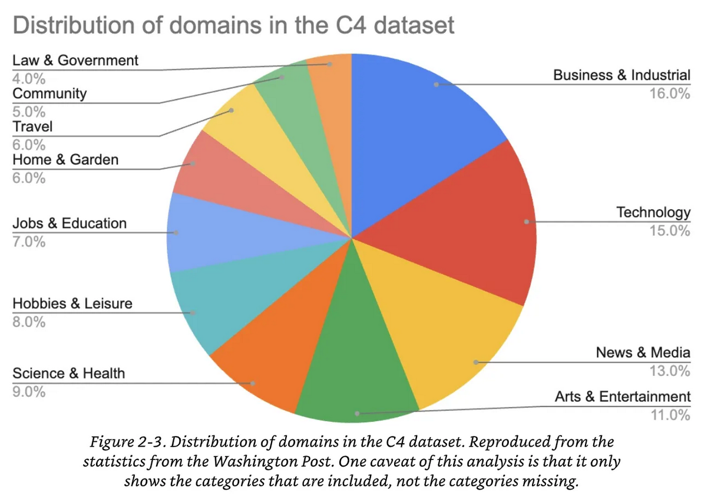
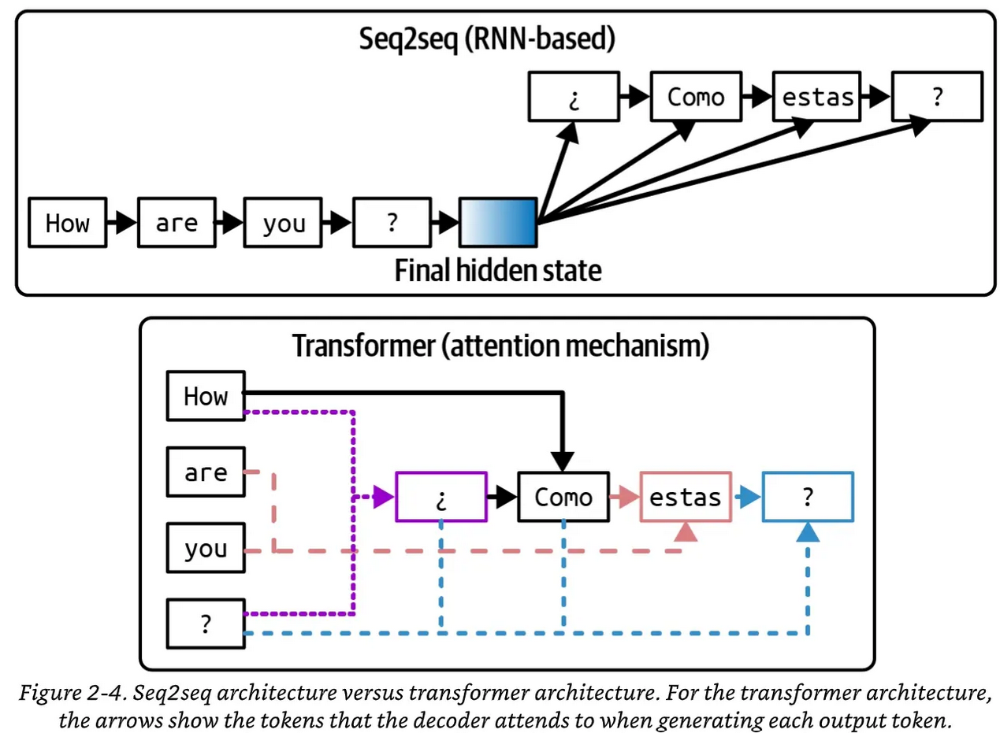

<style>
img[alt~="center"] {
  display: block;
  margin: 0 auto;
}
p.right-align {
  text-align: right;
}
</style>

# Deploying AI 
## Understanding Foundation Models

```code
$ echo "Data Science Institute"
```
---

# Introduction

---

# Agenda

---

## Agenda

* From machine learning to foundation models via deep learning
* Training, pre-training, post-training models
* Sampling, hallucinations, and the probabilistic nature of AI

---

## AI Engineering

We will be covering Chapter 2 of AI Engineering, by Chip Huyen.


---

# Understanding Foundation Models

---

## Reference Process Flow


<center>(Bommasani et al, 2025)</center>

---

# Training Data

---

## Training Data

+ An AI model is only as good as the data it was trained on. If there is no Spanish in the training data, the model cannot perform an English-Spanish translation.
+ Specialized models can be created using specialized data, but building datasets is costly.

---
## Standard Datasets

+ Standard datasets are many times used to train LLMs. 

  - [CommonCrawl](https://commoncrawl.org/): non-profit sporadically crawls the internet and in 2022-2023 crawled 2-3 billion pages per month. 
  - [Colossal Clean Crawled Corpus (C4)](https://www.semanticscholar.org/paper/Documenting-the-English-Colossal-Clean-Crawled-Dodge-Sap/40c3327a6ddb0603b6892344509c7f428ab43d81?itid=lk_inline_enhanced-template): Google provides a subset of Common Crawl.
  
+ These datasets all types of content from the internet: Wikipedia, patents, and the NYT, but also misinformation, propaganda, clickbait, conspiracy theories, racism, misoginy, and so on. [(Schaul et al, 2023)](https://www.washingtonpost.com/technology/interactive/2023/ai-chatbot-learning/)


---

## A Few Things to Note About Common Crawl (1/2)


### Common Crawl is huge, but it is not a "copy of the entire web"

  - English is over-represented in the dataset.
  - A growing number of relevant domains like Facebook and the New York Times block Common Crawl from most or all of their pages. [(Baack and Mozilla Insights, 2024)](https://www.mozillafoundation.org/en/research/library/generative-ai-training-data/common-crawl/).


---

## A Few Things to Note About Common Crawl (1/2)

### Common Crawl's mission does not easily align with needs of trustworthy AI, but devs many times use it without due care

  - Common Crawl produces data for many use cases, including research on hate speach. Its datasets deliberately include problematic content.
  - Filtered versions of Common Crawl can rely on (simplistic) approaches that are not sufficient to remove problematic content like keeping only top up-voted content from Reddit or to remove content that includes any word in the ["List of Dirty, Naughty, Obscene, and Otherwise Bad Words"](https://github.com/LDNOOBW/List-of-Dirty-Naughty-Obscene-and-Otherwise-Bad-Words?tab=readme-ov-file)  ([Baack and Mozilla Insights, 2024](https://www.mozillafoundation.org/en/research/library/generative-ai-training-data/common-crawl/)).


---

## Multilingual Models


+ English accounts for almost half (45%) the data in the Common Crawl dataset, eight times more prevalent than Russion, the second most represented language. 
+ Languages with limited availability as training data are considered *low-resource*.

+ Ref.: [(CommonCrawl, 2025)](https://commoncrawl.github.io/cc-crawl-statistics/plots/languages)

---


## GPT-4 Performance on MMLU Benchmark


+ On the MMLU benchmark, GPT-4 performs better in English. The MMLU benchmakr.
+ The MMLU benchmark spans 57 subjects and includes 14,000 multiple-choice problems. (Huyen, 2025)

---

## Underrepresented Languages

+ Given the dominance of English in the dataset,  general-purpose models work better for English than other languages. Models in languages that are not English:

  - Have poorer performance than in English.
  - Can behave unexpectedly.
  - Can perform slower and be more expensive.
+ Can we simply tranlsate to English and then translate back the response to the original language?

  - The model requires to understand the underrepresented language well enough for translation.
  - Translation can cause information loss.

---

# Domain-Specific Models

---

## General Purpose Models Perform Many Tasks

+ General purpose models like Gemini, GPTs, and Llamas can perform remarkably well in domains that include: coding, law, science, business, sports, and environmental science. 
+ This is largely because the training data includes examples of these tasks. (Huyen, 2025)



---

## Domain-Specific Models

+ Some examples are not available in standard or common data sets. For example:

  - Protein, DNA, and RNA data, which follow specific formats.
  - Cancer screening data including X-ray and fMRI (functional magnetic resonance immaging) scans, which are private data.

+ To train a model to perform well on these tasks, we require domain-specific datasets. For example:

  - DeepMind's AlphaFold model was trained on sequences and 3D structures of 100,000 known proteins.
  - NVIDIA's BioNeMo focuses on biomolecular data for drug discovery.
  - Google's Med-PaLM2 combines an LLM with medical data to answer medical queries with higher accuracy.

---

# From NLP to Foundation Models

---

## Reference Process Flow


<center>(Bommasani et al, 2025)</center>

---


## Two Key Innovations

+ Two key innovations have led to the current state of generative models:

  - Attention Mechanism
  - Transfer Learning


<center>(Tunstall et al, 2022)</center>

---

## Key Model Innovations


> "In 2017, researchers at Google published a paper that proposed a novel neural network architecture for sequence modelling. Dubbed the Transformer, this architecture outperformed recurrent neural networks (RNNs) on machine translation tasks, both in terms of translation quality and training cost.
>
> In parallel, an effective transfer learning method called ULMFiT showed that training long short-term memory (LSTM) networks on a very large and diverse corpus could produce state-of-the-art text classifiers with little labeled data." (Tunstall et al, 2022)

---

## Recurrent Neural Nets

+ Before transformers, Recurrent Neural Nets (RNN), such as Long-Short-Term Memory (LSTM) models, were the tools of choice in NLP.
+ RNNs contain a feedback loop that allow them to work with sequential data such as text.
+ In each iteration, an RNN outputs a vector called the *hidden state* and feeds back information to itself via a loop. 


<center>An unrolled RNN (Olah, 2015)</center>


---

## Sequence-to-Sequence Models

+ Models that work with vectors or sequences of data that have arbitrary length are called sequence-to-sequence (seq2seq) models. 
+ seq2seq models generally implement an encoder-decoder approach:

  - The encoder maps the input sequence into the *last hidden state*.
  - The decoder maps the *last hidden state* into an output sequence.
  
+ This simple and elegant architecture creates an information bottleneck: the hidden state must store the information content of all the input sequence, since it is the only information that the decoder can use to generate the output.
  
---

## Encoder-Decoder Framework


<center>Illustration of a translation task using RNN (Tunstall et al, 2022)</center>


---

## Issues with seq2seq

There are two issues with seq2seq:

+ Vanilla seq2seq decoder generates output tokens using only the *final* hidden state of the input.
+ Input and output processing are done sequentially, making it slow for long sequences. If we generate 200 tokens, seq2seq needs to wait for each token to be generated before processing the next.

---

## The Attention Mechanism


<center>Translation task and attention mechanism (Tunstall et al, 2022)</center>

---

## Attention Enhances Performance

+ Instead of producing a single hidden state for the input sequence, the encoder produces a hidden state at each step that the encoder can access.
+ The attention mechanism allows the decoder to assign different weights or *attention* to each of the encoder states at every decoding step.
+ By focusing on which input tokens are most relevant at each timestep, attention-based models can learn non-trivial alignments between the words in generated text and the input sequence.
+ Attention enhances performance.

---

## Seq2seq (RNN-based) vs Transformer


<center>(Huyen, 2025)</center>

---

## Self-Attention (1/2)


+ In the RNN architecture, computations are sequential and cannot be parallelized across the input sequence.
+ Transformer paradigm: remove recurrence and rely entirely on a special form of attention called *self-attention*.
+ Self-attention allows the attention mechanism to operate on all the states in the same layer of the neural network.
+ A distinguishing characteristic of this type of models is self-supervision. Self-supervised learning takes advantage of natural labels: any text sequence can be used as labelled data.

---

## Self-Attention (2/2)


<center>Self-Attention (Tunstall et al, 2022)</center>


---

## Inference for Transformer-Based Language Models

Inference for transformer-based language models requires two steps:

+ Prefill 

  - Process input tokens in parallel. 
  - Create the intermediate state necessary to generate the first output token.

+ Decode

  - The model generates one output token at a time.

---

## Three Vectors in the Attention Mechanism

+ The attention mechanism uses key, values, and query vectors.
+ **Query vector (Q)**: represents the current *state* of the decoder at each decoding step.
+ Each **key vector (K)** represents a previous token. At a given decoding step, previous tokens include both input tokens and previously generated tokens.
+ Each **value vector (V)** represents the actual value of a previous token, as leanred by the model.
---

## Dot Products in Attention


The attention mechanism computes how much attention to give to an input token by performing a dot product between the query vector and its key vector. (Huyen, 2025)

---

## Previous Tokens and Context Length

+ Each previous token is represented with a (key, value) pair.
+ Longer previous tokens require more (key, value) pairs to be computed and stored
+ This limits context length and it is a key reason to efficiently compute and store 

---

## Multi-Headed Attention

+ Multi-headed attention allows the model to attend to different groups of previous tokens simultaneously.
+ The attention mechanism is almost always multi-headed.

---

## Transformer Architecture (1/2)

+ Transformer architecture is composed of several transformer blocks.
+ A transformer block has two modules:

  - Attention module. Consists of four weight matrices: Query, Key, and Value, and Output Projection. 
  - Multi-Layer Perceptron (MLP) module or feed-forward (FF) layer.

+ (Vaswani et al, 2017)


---

## Transformer Architecture (2/2)

+ The number of transformer blocks in a transformer model is called the number of layers.
+ A transformer-based language model also has:

  - An embedding module before the transfomer blocks. Consists of embedding matrix and the positional embedding matrix.
  - An output layer after the transfomer blocks, the *model head*. Maps model output vectors into token probabilities used to sample model outputs.
+ (Vaswani et al, 2017)


---

## Size of a Transformer Model

The size of the transformer model is determined by the size of its building blocks, including:

+ The model's dimension determines the size of the key, query vlaue, and output projection matrices.
+ Number of transfomer blocks.
+ Dimension of the feedforward layer.
+ Vocabulary size


---

## Model Dimensions

Model | # transformer blocks | Model dim | FF dim | Vocab. size | Context length
------|----------------------|----------|---------|-------------|--------------
Llama 2-7B | 32 | 4,096| 11,008| 32k | 4k
Llama 2-13B | 40 | 5,120| 13,824| 32k | 4k
Llama 2-70B | 80 | 8,192| 22,016| 32k | 4k
Llama 3-7B | 32 | 4,096| 14,336| 128k | 128k
Llama 3-70B | 80 | 8,192| 28,672| 128k | 128k
Llama 3-405B | 126| 16,384| 53,248| 128k | 128k

<center>The dimension values of different Llama models (Huyen, 2025)</center>

---

## Model Size


<center>In general, more parameters means better learning and better models.</center>

---


 
 + Post-Training
   
    - Supervisde Finetuning
    - Preference Finetuning

---

# Sampling, hallucinations, and the probabilistic nature of AI


---


# References

---

## References

- Bommasani, Rishi, et al. "On the opportunities and risks of foundation models." [arXiv:2108.07258](https://arxiv.org/abs/2108.07258) (2021).
- Dodge, Jesse et al. “Documenting the English Colossal Clean Crawled Corpus.” [arXiv:2104.08758](https://arxiv.org/abs/2104.08758) (2021).
- Huyen, Chip. Designing machine learning systems. O'Reilly Media, Inc., 2022 
- Baack, Stefan, and Mozilla Insights. "Training data for the price of a sandwich." Retrieved May 9 (2024): 2024. [(URL)](https://www.mozillafoundation.org/en/research/library/generative-ai-training-data/common-crawl/)
- Schaul, Kevin, et al. Inside the secret list of websites that make AI like ChatGPT sound smart. Washington Post: April 19, 2023 [(URL)](https://www.washingtonpost.com/technology/interactive/2023/ai-chatbot-learning/).
- Olah, Chris. Understanding LSTM Networks. [(colah.github.io, 2015)](https://colah.github.io/posts/2015-08-Understanding-LSTMs/)
- Tunstall, Lewis, Leandro Von Werra, and Thomas Wolf. Natural language processing with transformers. "O'Reilly Media, Inc.", 2022.
- Vaswani, Ashish et al. "Attention is all you need." Advances in neural information processing systems 30.  [arXiv:1706.03762](https://arxiv.org/abs/1706.03762)(2017). 