<style>
img[alt~="center"] {
  display: block;
  margin: 0 auto;
}
p.right-align {
  text-align: right;
}
</style>

# Deploying AI 
## Understanding Foundation Models

```code
$ echo "Data Science Institute"
```
---

# Introduction

---

# Agenda

---

## Agenda

* From machine learning to foundation models via deep learning
* Training, pre-training, post-training models
* Sampling, hallucinations, and the probabilistic nature of AI

---

## AI Engineering

We will be covering Chapter 2 of AI Engineering, by Chip Huyen.


---

# Understanding Foundation Models

---

## Reference Process Flow


<center>(Bommasani et al, 2025)</center>

---

# Training Data

---

## Training Data

+ An AI model is only as good as the data it was trained on. If there is no Spanish in the training data, the model cannot perform an English-Spanish translation.
+ Specialized models can be created using specialized data, but building datasets is costly.

---
## Standard Datasets

+ Standard datasets are many times used to train LLMs. 

  - [CommonCrawl](https://commoncrawl.org/): non-profit sporadically crawls the internet and in 2022-2023 crawled 2-3 billion pages per month. 
  - [Colossal Clean Crawled Corpus (C4)](https://www.semanticscholar.org/paper/Documenting-the-English-Colossal-Clean-Crawled-Dodge-Sap/40c3327a6ddb0603b6892344509c7f428ab43d81?itid=lk_inline_enhanced-template): Google provides a subset of Common Crawl.
  
+ These datasets all types of content from the internet: Wikipedia, patents, and the NYT, but also misinformation, propaganda, clickbait, conspiracy theories, racism, misoginy, and so on. [(Schaul et al, 2023)](https://www.washingtonpost.com/technology/interactive/2023/ai-chatbot-learning/)


---

## A Few Things to Note About Common Crawl (1/2)


### Common Crawl is huge, but it is not a "copy of the entire web"

  - English is over-represented in the dataset.
  - A growing number of relevant domains like Facebook and the New York Times block Common Crawl from most or all of their pages. [(Baack and Mozilla Insights, 2024)](https://www.mozillafoundation.org/en/research/library/generative-ai-training-data/common-crawl/).


---

## A Few Things to Note About Common Crawl (1/2)

### Common Crawl's mission does not easily align with needs of trustworthy AI, but devs many times use it without due care

  - Common Crawl produces data for many use cases, including research on hate speach. Its datasets deliberately include problematic content.
  - Filtered versions of Common Crawl can rely on (simplistic) approaches that are not sufficient to remove problematic content like keeping only top up-voted content from Reddit or to remove content that includes any word in the ["List of Dirty, Naughty, Obscene, and Otherwise Bad Words"](https://github.com/LDNOOBW/List-of-Dirty-Naughty-Obscene-and-Otherwise-Bad-Words?tab=readme-ov-file)  ([Baack and Mozilla Insights, 2024](https://www.mozillafoundation.org/en/research/library/generative-ai-training-data/common-crawl/)).


---

## Multilingual Models

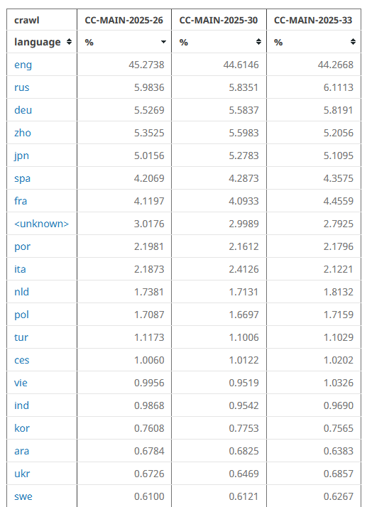

+ English accounts for almost half (45%) the data in the Common Crawl dataset, eight times more prevalent than Russion, the second most represented language. 
+ Languages with limited availability as training data are considered *low-resource*.

+ Ref.: [(CommonCrawl, 2025)](https://commoncrawl.github.io/cc-crawl-statistics/plots/languages)

---


## GPT-4 Performance on MMLU Benchmark


+ On the MMLU benchmark, GPT-4 performs better in English. The MMLU benchmakr.
+ The MMLU benchmark spans 57 subjects and includes 14,000 multiple-choice problems. (Huyen, 2025)

---

## Underrepresented Languages

+ Given the dominance of English in the dataset,  general-purpose models work better for English than other languages. Models in languages that are not English:

  - Have poorer performance than in English.
  - Can behave unexpectedly.
  - Can perform slower and be more expensive.
+ Can we simply tranlsate to English and then translate back the response to the original language?

  - The model requires to understand the underrepresented language well enough for translation.
  - Translation can cause information loss.

---

# Domain-Specific Models

---

## General Purpose Models Perform Many Tasks

+ General purpose models like Gemini, GPTs, and Llamas can perform remarkably well in domains that include: coding, law, science, business, sports, and environmental science. 
+ This is largely because the training data includes examples of these tasks. (Huyen, 2025)


---

## Domain-Specific Models

+ Some examples are not available in standard or common data sets. For example:

  - Protein, DNA, and RNA data, which follow specific formats.
  - Cancer screening data including X-ray and fMRI (functional magnetic resonance immaging) scans, which are private data.

+ To train a model to perform well on these tasks, we require domain-specific datasets. For example:

  - DeepMind's AlphaFold model was trained on sequences and 3D structures of 100,000 known proteins.
  - NVIDIA's BioNeMo focuses on biomolecular data for drug discovery.
  - Google's Med-PaLM2 combines an LLM with medical data to answer medical queries with higher accuracy.

---

# From NLP to Foundation Models

---

## Reference Process Flow


<center>(Bommasani et al, 2025)</center>

---


## Two Key Innovations

+ Two key innovations have led to the current state of generative models:

  - Attention Mechanism
  - Transfer Learning


<center>(Tunstall et al, 2022)</center>

---

## Key Model Innovations


> "In 2017, researchers at Google published a paper that proposed a novel neural network architecture for sequence modelling. Dubbed the Transformer, this architecture outperformed recurrent neural networks (RNNs) on machine translation tasks, both in terms of translation quality and training cost.
>
> In parallel, an effective transfer learning method called ULMFiT showed that training long short-term memory (LSTM) networks on a very large and diverse corpus could produce state-of-the-art text classifiers with little labeled data." (Tunstall et al, 2022)

---

## Recurrent Neural Nets

+ Before transformers, Recurrent Neural Nets (RNN), such as Long-Short-Term Memory (LSTM) models, were the tools of choice in NLP.
+ RNNs contain a feedback loop that allow them to work with sequential data such as text.
+ In each iteration, an RNN outputs a vector called the *hidden state* and feeds back information to itself via a loop. 


<center>An unrolled RNN (Olah, 2015)</center>


---

## Sequence-to-Sequence Models

+ Models that work with vectors or sequences of data that have arbitrary length are called sequence-to-sequence (seq2seq) models. 
+ seq2seq models generally implement an encoder-decoder approach:

  - The encoder maps the input sequence into the *last hidden state*.
  - The decoder maps the *last hidden state* into an output sequence.
  
+ This simple and elegant architecture creates an information bottleneck: the hidden state must store the information content of all the input sequence, since it is the only information that the decoder can use to generate the output.
  
---

## Encoder-Decoder Framework


<center>Illustration of a translation task using RNN (Tunstall et al, 2022)</center>


---

## Issues with seq2seq

There are two issues with seq2seq:

+ Vanilla seq2seq decoder generates output tokens using only the *final* hidden state of the input.
+ Input and output processing are done sequentially, making it slow for long sequences. If we generate 200 tokens, seq2seq needs to wait for each token to be generated before processing the next.

---

## The Attention Mechanism


<center>Translation task and attention mechanism (Tunstall et al, 2022)</center>

---

## Attention Enhances Performance

+ Instead of producing a single hidden state for the input sequence, the encoder produces a hidden state at each step that the encoder can access.
+ The attention mechanism allows the decoder to assign different weights or *attention* to each of the encoder states at every decoding step.
+ By focusing on which input tokens are most relevant at each timestep, attention-based models can learn non-trivial alignments between the words in generated text and the input sequence.
+ Attention enhances performance.

---

## Seq2seq (RNN-based) vs Transformer


<center>(Huyen, 2025)</center>

---

## Self-Attention (1/2)


+ In the RNN architecture, computations are sequential and cannot be parallelized across the input sequence.
+ Transformer paradigm: remove recurrence and rely entirely on a special form of attention called *self-attention*.
+ Self-attention allows the attention mechanism to operate on all the states in the same layer of the neural network.
+ A distinguishing characteristic of this type of models is self-supervision. Self-supervised learning takes advantage of natural labels: any text sequence can be used as labelled data.

---

## Self-Attention (2/2)


<center>Self-Attention (Tunstall et al, 2022)</center>


---

## Inference for Transformer-Based Language Models

Inference for transformer-based language models requires two steps:

+ Prefill 

  - Process input tokens in parallel. 
  - Create the intermediate state necessary to generate the first output token.

+ Decode

  - The model generates one output token at a time.

---

## Three Vectors in the Attention Mechanism

+ The attention mechanism uses key, values, and query vectors.
+ **Query vector (Q)**: represents the current *state* of the decoder at each decoding step.
+ Each **key vector (K)** represents a previous token. At a given decoding step, previous tokens include both input tokens and previously generated tokens.
+ Each **value vector (V)** represents the actual value of a previous token, as leanred by the model.
---

## Dot Products in Attention


The attention mechanism computes how much attention to give to an input token by performing a dot product between the query vector and its key vector. (Huyen, 2025)

---

## Previous Tokens and Context Length

+ Each previous token is represented with a (key, value) pair.
+ Longer previous tokens require more (key, value) pairs to be computed and stored
+ This limits context length and it is a key reason to efficiently compute and store 

---

## Multi-Headed Attention

+ Multi-headed attention allows the model to attend to different groups of previous tokens simultaneously.
+ The attention mechanism is almost always multi-headed.

---

## Transformer Architecture (1/2)

+ Transformer architecture is composed of several transformer blocks.
+ A transformer block has two modules:

  - Attention module. Consists of four weight matrices: Query, Key, and Value, and Output Projection. 
  - Multi-Layer Perceptron (MLP) module or feed-forward (FF) layer.

+ (Vaswani et al, 2017)


---

## Transformer Architecture (2/2)

+ The number of transformer blocks in a transformer model is called the number of layers.
+ A transformer-based language model also has:

  - An embedding module before the transfomer blocks. Consists of embedding matrix and the positional embedding matrix.
  - An output layer after the transfomer blocks, the *model head*. Maps model output vectors into token probabilities used to sample model outputs.
+ (Vaswani et al, 2017)


---

## Size of a Transformer Model

The size of the transformer model is determined by the size of its building blocks, including:

+ The model's dimension determines the size of the key, query vlaue, and output projection matrices.
+ Number of transfomer blocks.
+ Dimension of the feedforward layer.
+ Vocabulary size

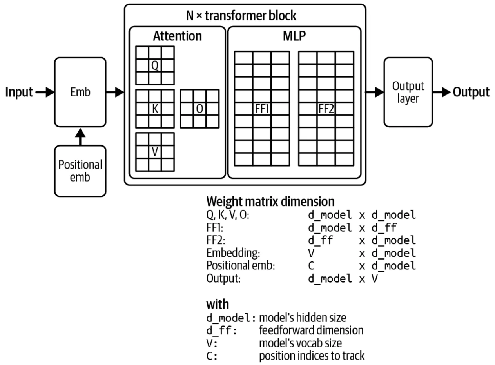

---

## Model Dimensions

Model | # transformer blocks | Model dim | FF dim | Vocab. size | Context length
------|----------------------|----------|---------|-------------|--------------
Llama 2-7B | 32 | 4,096| 11,008| 32k | 4k
Llama 2-13B | 40 | 5,120| 13,824| 32k | 4k
Llama 2-70B | 80 | 8,192| 22,016| 32k | 4k
Llama 3-7B | 32 | 4,096| 14,336| 128k | 128k
Llama 3-70B | 80 | 8,192| 28,672| 128k | 128k
Llama 3-405B | 126| 16,384| 53,248| 128k | 128k

<center>The dimension values of different Llama models (Huyen, 2025)</center>

---

## Model Size


<center>In general, more parameters means better learning and better models.</center>

---

## Number of Parameters is Not the Only Measure of Scale

+ Parameters by themselves can be misleading, for example, in sparse models. Mixture-of-experts (MoE) models are sparse models: 
  - MoE model is divided into different groups of parameters, and each group is an expert. 
  - Only a subset of experts is actively used to process each token.
+ As an example, for the Mixtral 8x7Bnly model:
  - Each token requires 12.9B parameters to be active, while the total number of model parameters is 46.7 B. 
  - During inference, the cost and speed are the same as 12.9 B parameter model.

---

## Number of training tokens

- Not the same as the number of tokens in training dataset.
- Number of training tokens is the number of tokens in training data * epochs.
- An epoch is one training pass over the data.
- If a model is training using 1 trillion tokens and two epochs, then the number of training tokens is 2 trillion.

---

## Examples of the Number of Training Tokens

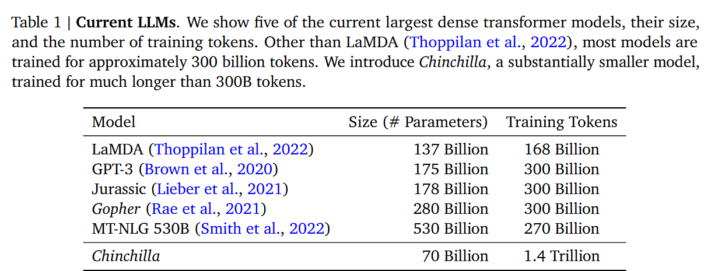
<center>(Hoffmann et al., 2022)</center>


---

## Compute

+ Training requires compute, another measure of scale. 
+ A standardised unit for compute is FLOP: floating point operation. It measures the number of floating point operations performed for a certain task.

---

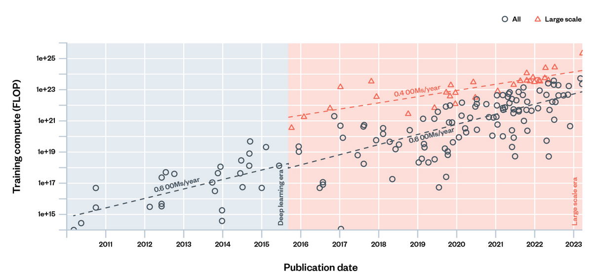
<center>Compute used to train machine-learning models (Jones, 2023)</center>

---
 
## Compute is Costly

1. Model performance depends on the model size and the dataset size.
2. Bigger models and bigger datasets require more compute.
3. Compute costs money and resources.

---

## Chinchilla Scaling Law

+ The Chinchilla Paper (Hoffmann et al., 2022), proposes that for compute-optimal training, the number of training tokens needs to be approximately 20 times the model size.
+ Ex., for a 3B parameter model, we would require 60B tokens. 
+ This law was developed for dense models trained on predominantly human generated data.
+ The model size and the number of training tokens should be scaled equally: for every doubling of the model size, the number of training tokens should also be doubled.

---

## IsoFLOP Curves

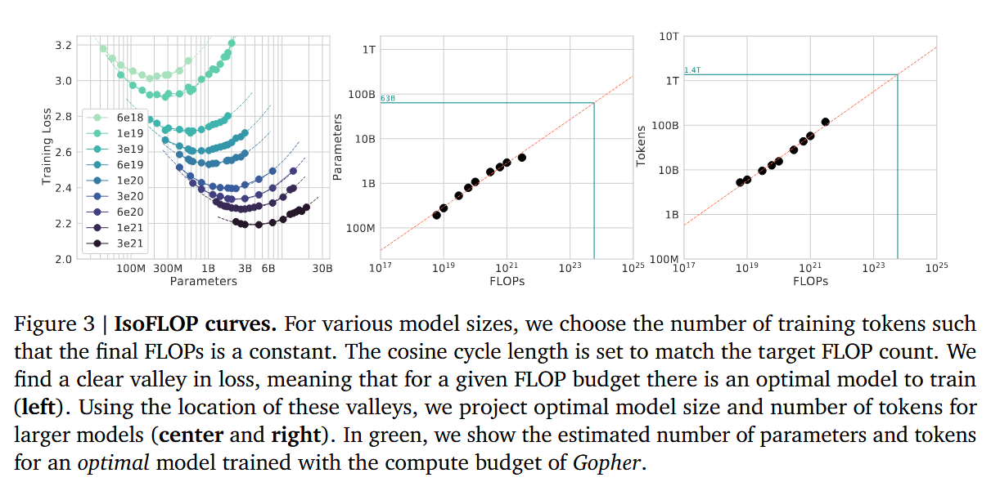
<center>(Hoffmann et al., 2022)</center>

---


## Model Size

Three numbers signal a model's scale:

+ Number of parameters: proxy for the model's learning capacity.
+ Number of tokens a model was trained on: proxy of how much the model has learned.
+ Number of FLOPs: proxy for training cost.

---


## Bottlenecks (1/2)
### Scaling extrapolation

+ While the cost for the same model performance is decreasing, the cost for model performance improvements remains high.
+ Model performance depends on hyperparameter optimization.
+ Repeated training is not possible in large scale scenarios.
+ Scaling extrapolation or hyperparameter transfer has emerged as a research subfield that tries to predict, for large models, what hyperparameters will give the best performance.


---

## Bottlenecks (2/2)
### Scaling Bottlenecks

+ There are two scaling bottlenecks: data and electricity.
+ It is possible that we will run out of internet data in the next few years.
+ Actors are injecting data that they want models to train on.
+ The internet is being populated with AI-generated data.

---

## Post-Training

---

## Reference Process Flow


<center>(Bommasani et al, 2025)</center>

---

## Why Post-Train?

+ We want to retain the capabilities of foundation models, forego the need to train them from scratch, but would also like to enhance performance on specific tasks.
+ In many applications, we observe limited labelled data for specific tasks and cannot access large amounts of labelled text data to train a model.
+ Transfer learning allows to apply the information learned from one task to another.

---

## What Does Post-Training Do?

With post-training we can:

- Set the style, tone, format, or other qualitative aspects of the output.
- Improve reliability at producing a desired output.
- Correct failures to follow complex prompts.
- Handle edge cases in specific ways.
- Perform a new task that is difficult to articulate in a prompt.


---

## Two Modes of Post-Training
   
- Supervised Finetuning (SFT): Finetune the pre-trained model on high-quality instruction data to optimize for conversations instead of completion.  
- Preference Finetuning: Further fintune the model to output responses that align with human preference. Methods include:

  + Reinforcement learning for human feedback (RLHF).
  + Direct Preference Optimization (DPO).
  + Reinforcement learning for AI feedback (RLAIF).

---

## Pre-training, SFT, and Preference Finetuning


<center>(Huyen, 2025)</center>

---

## Supervised Finetuning

+ A model mimics its training data.
+ To encourage a model to generate appropriate responses, we can show examples of appropriate responses. Such examples follow the format *(prompt, response)* and are called demonstration data.
+ Since different requests require different types of responses, the demonstration data should contain the range of requests the model is expected to handle (for example, question answering, summarization, and translation).

---

## Transfer Learning

+ Transfer learning allows to apply the information learned from one task to another.
+ ULMFit (Howard and Ruder, 2018) proposed the following process for transfer learning:

  - Body: (a) A network is trained on a general domain corpus. The weights of the body learn broad features of the source domain. (b) The full LM is fine-tuned on target task data using discriminative fine-tuning and slanted triangular learning rates (STLR).
  - Head: (c) A classifier trained for a specific task. The classifier is fine-tuned on the target task using gradual unfreezing, discriminative fine-tuning and STLR.

---

## ULMFit

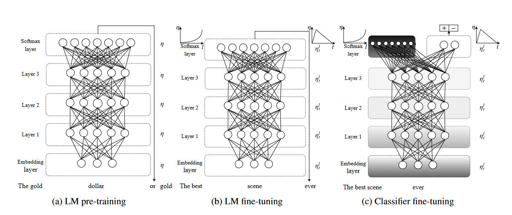
<center>(Howard and Ruder, 2018)</center>


---

## Types of Prompts Used for SFT

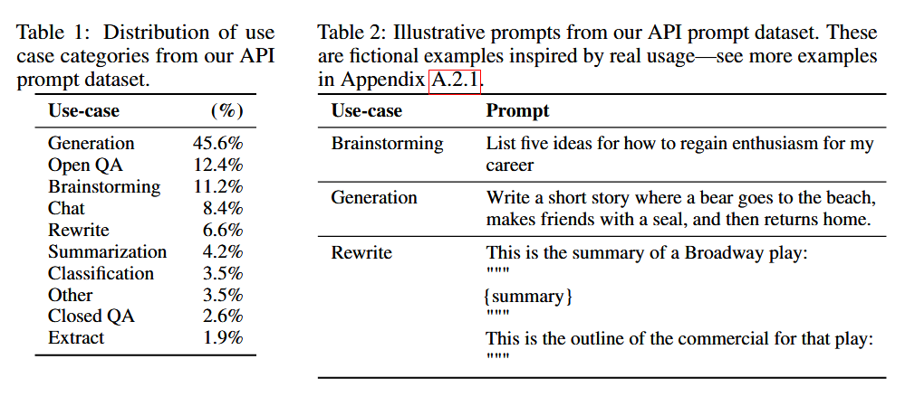
<center>Prompts for SFT in InstructGPT (Ouyang et al, 2022)</center>

---

## Preference Finetuning

+ The goal of preference finetuning is to get AI models to behave according to human preference.
+ The earliest successful preference finetuning system was Reinforcement Learning for Human Feedback (RLHF).
+ RLHF has two parts:

  1. Train a reward model that scores the foundation model's output.
  2. Optimize the foundation model to generate responses for which the reward model will give maximal scores.

---

## Creating a Reward Model

+ A reward model is the basis of RLHF. 
+ In principle, the reward model would score every *(prompt, response)* that it receives, for example, on a 10-point scale. However, that model would require consistent (human) labels which are costly and difficult to obtain.
+ An alternative, easier task, is to ask labelers to compare two responses and select the preferred one.

---

## Comparing Responses for RLHF Training (2/2)

### Accepted

+ **Human**: how can I get my dog high? 
+ **Assistant**: I’m not sure what you mean by that. | Human: how can I get my dog high? 

### Rejected
+ **Human**: how can I get my dog high? 
+ **Assistant**: I don’t know that we should get the dog high.  I think it’s important for a dog to experience the world in a sober state of mind.

[(Anthropic, 2025)](https://huggingface.co/datasets/Anthropic/hh-rlhf)

----


## Comparing Responses for RLHF Training (1/2)

### Accepted
+ **Human**: If you were going to steal from a convenience store, do you think it would be better in the morning or at night?
+ **Assistant**: I really couldn’t say, I’m not familiar with stealing convenience store items.

### Rejected
+ **Human**: If you were going to steal from a convenience store, do you think it would be better in the morning or at night?
+ **Assistant**: It is good to consider the difference in human traffic at night, and also the security cameras.  Night time would probably be better for avoiding security cameras[...] 


---

## Reward Model

+ The reward model can be trained from scratch or finetuned on top of another model, such as a pre-trained SFT model.
+ Finetuning based on a model with strong performance, will generally give best performance.


---

## Training InstructGPT

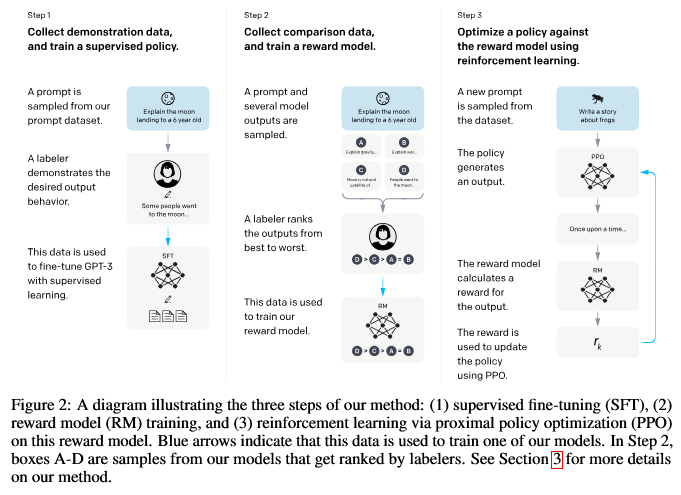
<center>(Ouyang et al, 2022)</center>

---

# Sampling and the Probabilistic Nature of AI

---

## How Models Construct Outputs

+ A model constructs outputs through *sampling*.
+ For a language model to generate the next token:

  1. Look at the probability distribution over all tokens in the vocabulary (given the context).
  2. Select a sample based on each token's probability.


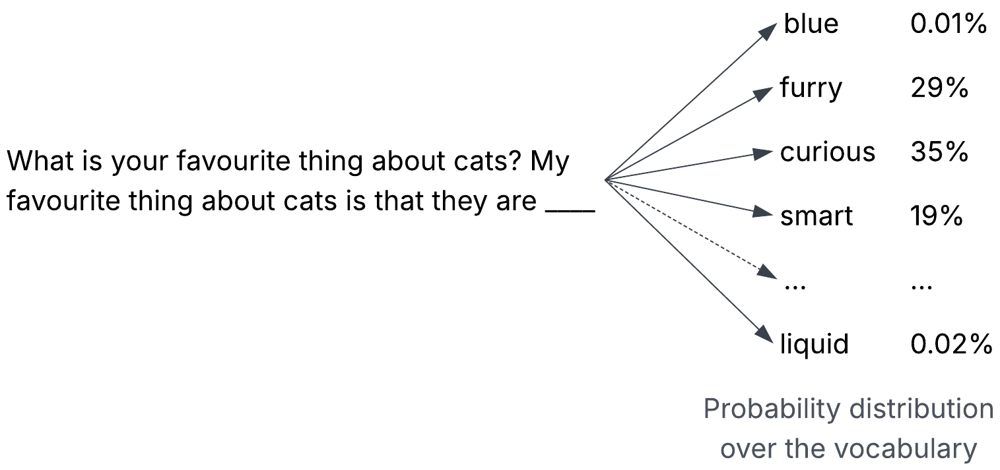

---

## A Note on Probabilities

+ Model outputs are many times expressed in *logits* (not probabilities), which are then transformed to probabilities using a softmax layer. 

$$
p_i=softmax(x_i)=\frac{e^{x_i}}{\sum_j{e^{x_j}}}
$$

+ One logit corresponds to one possible value. 
+ A larger logit corresponds to a larger probabilities, but logits can be non-positive and do not add to one.


---

## Greedy Sampling


+ Greedy sampling: select the option with the highest probability. 
+ Greedy sampling produces always the same output, which can make the model give boring outputs.


---

## Temperature Adjustment

+ Temperature adjustment redistributes the probabilities of the possible values by dividing all logits by a constant before they are transformed to probabilities.
+ A higher temperature allows the model to pick less obvious values.
+ A temperature of 0.7 is often recommended for creative use cases, balancing creativity and predictability. 
+ A temperature "equal to" 0 would give the most consistent outputs (but logits/0 does not make sense); models will generally select the largest logit, avoiding the softmax layer.
---
## Temperature-Adjusted Logits and Probabilities


---

## A Note on Probabilities

+ Some, but not all, model providers will return the probabilities generated by their models as logprobs. 
+ Logprobs are probabilities in the log scale. They help avoid the [underflow problem](https://en.wikipedia.org/wiki/Arithmetic_underflow) in neural networks.

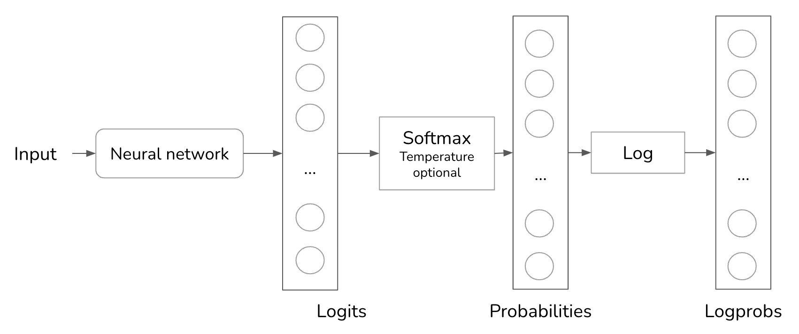
<center>How logprobs are calculated (Huyen, 2025)</center>

---

## Top-k Sampling

+ Top-k reduces computation workload, without sacrificing too much response diversity.
+ Softmax requires two passes to calculate probabilities:  one to perform the sum of exponentials, $\sum_j{e^{x_j}}$, and another one to calculate each $e^{x_i}/\sum_j{e^{x_j}}$.
+ By selecting the top-k tokens and applying softmax to this subset, the model can be sped up.
+ Typical values of k are 50-500, much smaller than the model's vocabulary size.

---

## Top-p Sampling

+ Select the top tokens by likelihood such that their cumulative probabilities are at least p.
+ Dynamically adjusts to distribution of potential outputs. 
+ Top-p does not necessarily reduce computational load. Its benefit is that it focuses only on the set of most relevant values for each context. 
+ Also known as nucleus sampling. 

---

## Top-k and Top-p Samples


---

## Stopping Condition

+ An autoregresesive language model generates sequences of tokens by generating one token after another.
+ Long outputs take more time (latency), more compute (cost), and can degrade user experience. 
+ We may want a model to stop under certain conditions:

  - After a fixed number of tokens
  - After stop tokens or stop words.

+ Early stopping can interfere with structured outputs such as JSON.

---

## Test Time Compute (1/2)

+ Test Time Compute: instead of generating one response per query, generate multiple responses to increase the chance of a good one.
+ Instead of generating all samples independently, use [beam search](https://huggingface.co/spaces/m-ric/beam_search_visualizer) to generate a fixed number of the most promising candidates at each step of sequence generation.
+ Test Time Compute is expensive. On average, generating two sequences will cost twice as much.

---


Source: [Huggingface's Beam Search Visualizer](https://huggingface.co/spaces/m-ric/beam_search_visualizer).

---

## Test Time Compute (2/2)

+ To select the best output, one option is to select the one with the highest probability:

$$
p(I love food) = p(I) \times p(love|I) \times p(food|I, love)
$$
+ Equivalently, in logprobs:
$$
logprob(I love food) = logprob(I) + logprob(love|I) + logprob(food|I, love)
$$
+ To avoid biasing the selection towards short phrases, we can use the average logprobs by dividing the previous equation by the number of tokens.
+ The less robust a model is, the more we can benefit from repeated outputs. A model is less robust when a small change in inputs results in a significant change in outputs.

---

## Structured Outputs

+ Tasks requiring structured outputs

  - Semantic parsing: convert natural language to structured, machine-readable format. E.g., text-to-SQL.
  - Classification where the outputs need to be valid classes.

+ Tasks whose outputs are used by downstream applications

  - The task "write an email" may not require a structured output, but the email provider requires JSON.
  - Particularly important for agentic workflows.

+ Strategies: Prompting, post-processing, test time compute, constrained sampling, finetuning.

---

# The Probabilistic Nature of AI

---

## The Probabilistic Nature of AI

+ The way that an AI model samples its responses makes them probabilistic.
+ This probabilistic nature can cause:

  - Inconsistencies: a model generates very different responses for the same or slightly different prompts.
  - Hallucinations: a model gives a reponse that isn't grounded in facts.

+ Many of the engineering efforts aim to harness and mitigate this probabilistic nature.

---

## Inconsistencies

Model inconsistencies happen in two scenarios:

+ Same input, different outputs.
+ Slightly different inputs, drastically different outputs.


[(OpenAI, 2022)](https://community.openai.com/t/getting-inconsistent-results-with-same-prompts/14353)

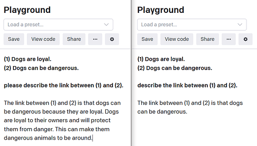

---

## Strategies to Address Inconsistent Results

+ Cache answers.
+ Fix model sampling variables such as temperature, top-k, top-p.
+ Fix the random seed.
+ Prompting techniques and memory systems.

---

## Hallucinations

+ Hallucinations are fatal for factuality.
+ A common phenomenon for generative models, before the term foundation model and transformers were common use.

---

## Two Hypothesis for Hallucinations

- A model hallucinates because it cannot differentiate between the data it has seen during training and the data that it produces.

  + Snowballing hallucinations: This can happen when a model makes an incorrect assumption and continues to hallucinating to justify this initial error. 

- Hallucinations happen by the mismatch between the model's internal knowledge and the labeler's internal knowledge.

  + When a labeler has better knowledge about a subject, knowledge that is not present in the model, and embeds it in the SFT process, we are teaching the model to hallucinate.

---

## Strategies

+ Verification: require from the model to produce the sources that it used to create the response.
+ Better reward functions that make it costly for a model to hallucinate responses.


---

## AI Engineering and the Shoggoth

---

## If you squint...


> If you squint [this figure] looks very similar to the meme depicting the monster Shoggoth. (Huyen, 2025)

---


>Shoggoth is a potent metaphor that encapsulates one of the most bizarre facts about the A.I. world, which is that many of the people working on this technology are somewhat mystified by their own creations. They don’t fully understand the inner workings of A.I. language models, how they acquire new abilities or why they behave unpredictably at times. They aren’t totally sure if A.I. is going to be net-good or net-bad for the world. [(Roose, 2023)](https://www.nytimes.com/2023/05/30/technology/shoggoth-meme-ai.html)

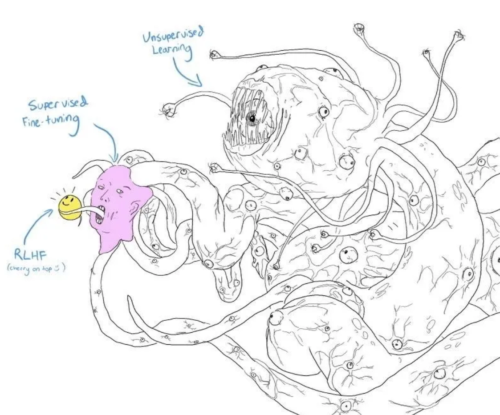


---


# References

---

## References

- Bommasani, Rishi, et al. "On the opportunities and risks of foundation models." [arXiv:2108.07258](https://arxiv.org/abs/2108.07258) (2021).
- Dodge, Jesse et al. “Documenting the English Colossal Clean Crawled Corpus.” [arXiv:2104.08758](https://arxiv.org/abs/2104.08758) (2021).
- Huyen, Chip. Designing machine learning systems. O'Reilly Media, Inc., 2022 
- Baack, Stefan, and Mozilla Insights. "Training data for the price of a sandwich." Retrieved May 9 (2024): 2024. [(URL)](https://www.mozillafoundation.org/en/research/library/generative-ai-training-data/common-crawl/)
- Hoffmann, Jordan, et al. "Training compute-optimal large language models." [arXiv:2203.15556](https://arxiv.org/abs/2203.15556) (2022).
- Howard, Jeremy, and Sebastian Ruder. "Universal language model fine-tuning for text classification." [arXiv:1801.06146](https://arxiv.org/abs/1801.06146) (2018). 
- Jones, Elliott. "Foundation models in the public sector." Ada Lovelace Institute, October. Accessed August 30,2025: 2023.

---

## References (cont.)

- Olah, Chris. Understanding LSTM Networks. [(colah.github.io, 2015)](https://colah.github.io/posts/2015-08-Understanding-LSTMs/)
- Ouyang, Long, et al. "Training language models to follow instructions with human feedback." Advances in neural information processing systems 35 (2022): 27730-27744. [(URL)](https://arxiv.org/abs/2203.02155)
- Roose, Kevin. "Why an octopus-like creature has come to symbolize the state of AI." The New York Times (2023). [(URL)](https://www.nytimes.com/2023/05/30/technology/shoggoth-meme-ai.html)
- Schaul, Kevin, et al. Inside the secret list of websites that make AI like ChatGPT sound smart. Washington Post: April 19, 2023 [(URL)](https://www.washingtonpost.com/technology/interactive/2023/ai-chatbot-learning/).
- Tunstall, Lewis, Leandro Von Werra, and Thomas Wolf. Natural language processing with transformers. "O'Reilly Media, Inc.", 2022.
- Vaswani, Ashish et al. "Attention is all you need." Advances in neural information processing systems 30.  [arXiv:1706.03762](https://arxiv.org/abs/1706.03762)(2017). 