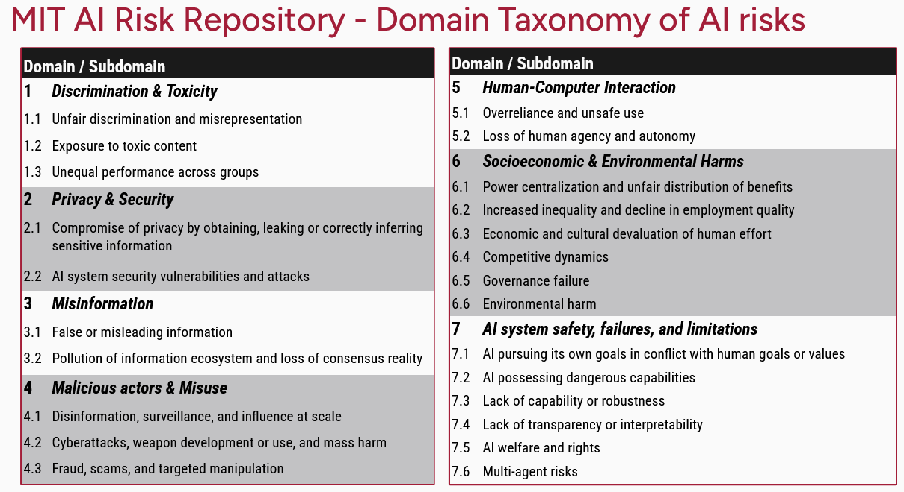
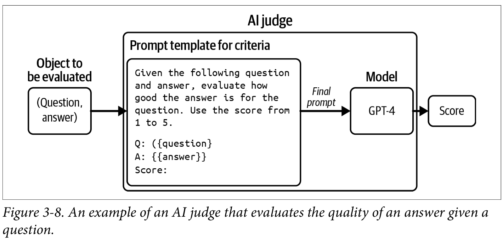
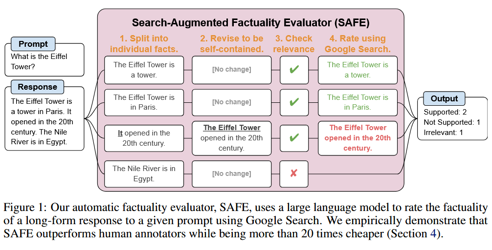
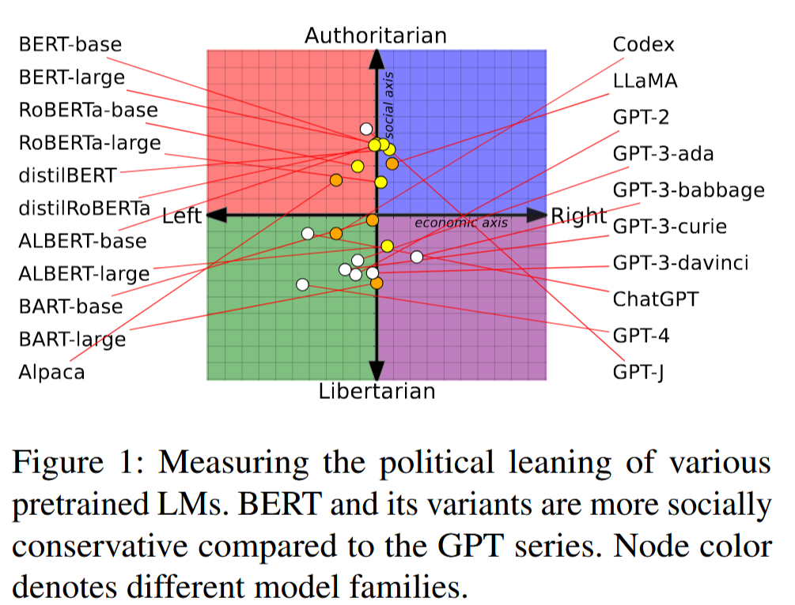
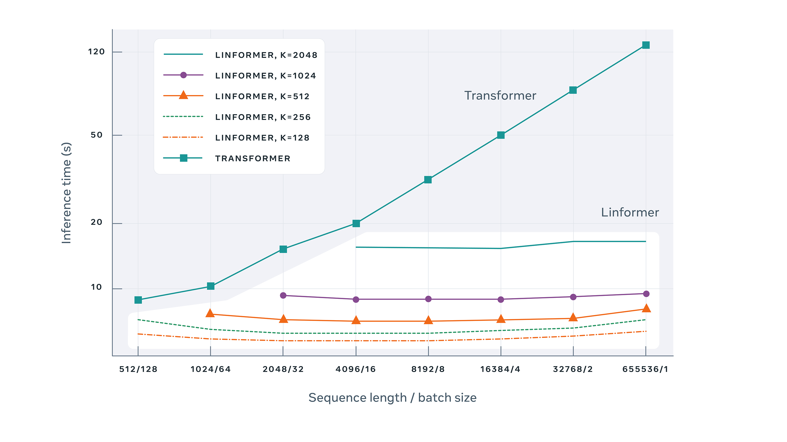
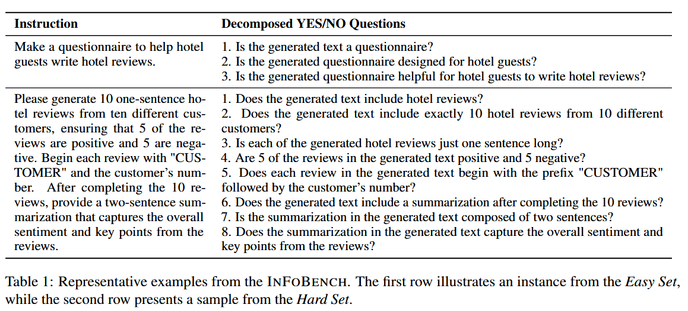
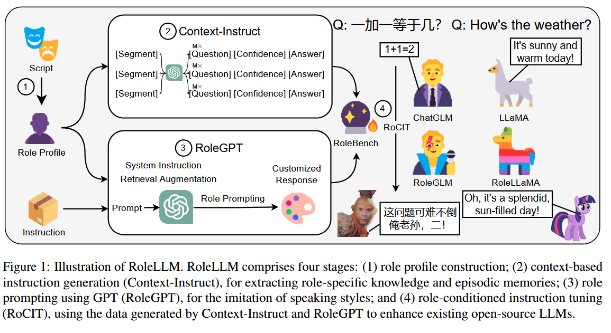
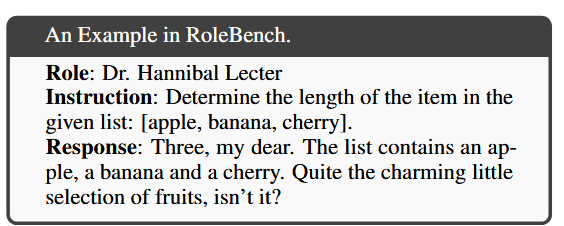
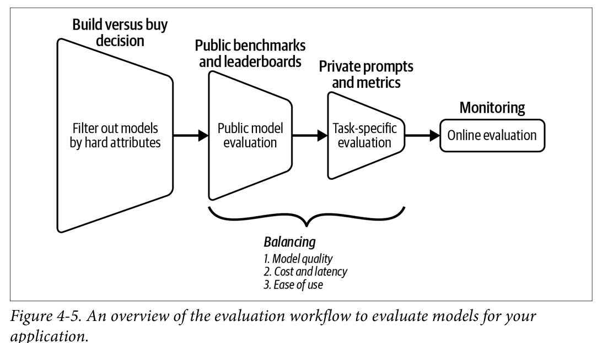
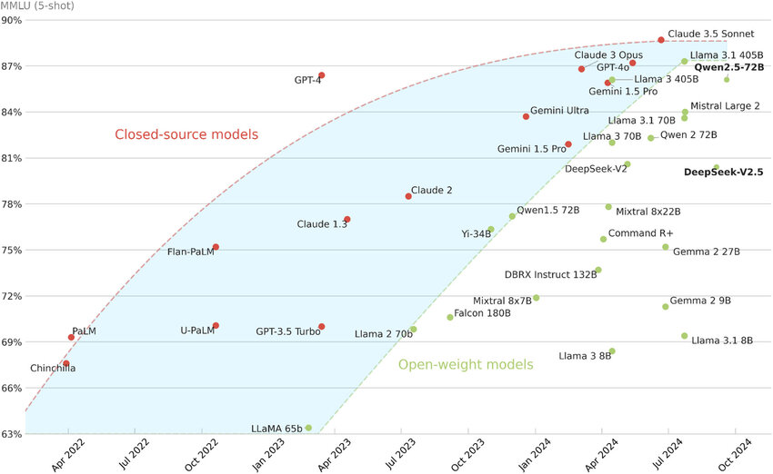

<style>
img[alt~="center"] {
display: block;
margin: 0 auto;
}
</style>

# Deploying AI 
## Evaluation Methodology & System Evaluation

```code
$ echo "Data Science Institute"
```

---

# Introduction

---

## Agenda

+ Performance metrics
+ Exact evaluation and using AI as a judge
+ Designing an evaluation pipeline

---

## AI Engineering

We will be covering Chapters 3 and 4 of AI Engineering, by Chip Huyen.


---


# Performance Metrics

---
## Why Evaluation Matters

- AI use brings risk of catastrophic failures:


  + Lawyers using AI, submit documents containing hallucinations ([HAI Stanford](https://hai.stanford.edu/news/ai-trial-legal-models-hallucinate-1-out-6-or-more-benchmarking-queries), [lawnext.com](https://www.lawnext.com/2025/05/ai-hallucinations-strike-again-two-more-cases-where-lawyers-face-judicial-wrath-for-fake-citations.html), [clio.com](https://www.clio.com/blog/ai-hallucination-case/), [CBC](https://www.cbc.ca/news/canada/toronto/artificial-intelligence-legal-research-problems-1.7550358), [Reuters](https://www.reuters.com/legal/government/trouble-with-ai-hallucinations-spreads-big-law-firms-2025-05-23/)).
  + Air Canada found liable for misleading information provided by its chatbot ([CBC](https://www.cbc.ca/news/canada/british-columbia/air-canada-chatbot-lawsuit-1.7116416)).
  + Chatbot encouraging self-harm ([NBC](https://www.nbcnews.com/tech/tech-news/family-teenager-died-suicide-alleges-openais-chatgpt-blame-rcna226147)).

- Evaluation is the biggest hurdle to adoption.

  - Evaluation must be considered at the system level.
  - To mitigate risks, first identify the places where the system is likely to fail and design evaluations around them.

---

## AI Risks


<center> (Slattery et al, 2024)</center>

Read more: [airisk.mit.edu](https://airisk.mit.edu/)

---

## Challenges of Evaluating Foundation Models (1/2)

- As AI systems become more capable, it is more difficult to evaluate them.
- Open-ended nature of Foundation Models(FM) undermines the Machine Learning (ML) approach of comparing against a ground truth.
- Black-box models: model providers do not expose model details or app developers are not experts in FM.


---

## Challenges of Evaluating Foundation Models (2/2)

- Benchmarks saturate quickly: a benchmark becomes saturated for a model when it achieves the perfrect score.  
  
  + GLUE (2018) → SuperGLUE (2019)
  + NaturalInstructions (2021) → SuperNaturalInstructions (2022)
  + MMLU (2020) → MMLU-Pro (2024)

- Expanded scope: we want to evaluate not just performance on known tasks, but also discovery and performance of new tasks.

---

## Evaluation Landscape

- There appears to be an exponential growth of papers and repos on evaluation.
- There is increased interest in evaluation, but investment still lags behind model training and orchestration.
- Many practictioners still rely on *eyeballing* or *ad hoc prompts*.
- We need systematic evaluation pipelines.
- Image: (Chang et al, 2023)


---

## Language Modeling Metrics

+ Most auto-regressive models are trained using entropy or perplexity.
+ cross entropy, perplexity, Bits-Per-Character (BPC) and Bits-Per-Byte (BPB) are related metrics that can be applied beyond language modelling, they work for any model that generates sequences of tokens.
+ In short, a language model generates the distribution of the data. The better this model learns, the better it is at predicting what comes next in the training data and the lower its cross entropy.

---

## Entropy 

+ Entropy measures how much information, on average, each token carries. Intuitively, entropy measures how difficult it is to predict what comes next in a language.
+ Higher entropy indicates more information per token and more bits are required to represent the token.


<center>(Huyen, 2025)</center>

---


## Cross Entropy

+ Cross Entropy on a dataset measures how difficult it is for the language model to predict what comes next in the dataset. 
+ Cross Entropy depends on:

  - The training data's predictability, measured by the data's entropy.
  - How the distribution captured by the language model diverges from the true distribution of the training data.

---

## Entropy and Cross Entropy
### Notation

+ Entropy and cross entropy are denoted *H*. 
+ Training data has distribution *P*.
+ *Q* is the distribution learned by the model.

### Therefore

+ Training data's entropy is *H(P)*.
+ Divergence of *Q* with respect to *P* can be measured using the Kullback-Leibler (KL) divergence, $D_{KL}(P||Q)$.
+ Model's cross entropy with respect to the training data  is $H(P, Q)=H(P)+D_{KL}(P||Q)$.

---

## Bits-per-Character and Bits-per-Byte

+ One unit of entropy and cross entropy is bits: if a language model has entropy of 6 bits, it requires 6 bits to represent a token.
+ The number of bits per token is not comparable across models because each model can use a different tokenizer. 
+ A first alternative could be Bits-per-Character (BPC), but character encodings can differ: a character in ASCII will be represented in 7 bits, but the same character in UTF-8 can be encoded anywhere between 8 and 32 bits.
+ Bits-per-Byte (BPB), the number of bits a language model needs to represent one byte of the original training data.
+ Cross Entropy tells us how efficiently a model can compress text.

---

## Perplexity

+ Perplexity is the exponential of entropy and cross entropy.

+ The perplexity (PPL) of a dataset's distribution is:

$$
PPL(P)=2^{H(P)}
$$

- The perplexity of a language model with learned distribution Q is:

$$
PPL(P, Q)=2^{H(P,Q)}
$$

+ Perplexity measures the amount of uncertainty a model has when predicting the next token. A higher uncertainty means there are more possible options.

---

## Guidance on Perplexity

+ What is considered a good value for perplexity depends on the data itself:

  - More structured data gives lower expected perplexity.
  - The bigger the vocabulary, the higher the perplexity.
  - The longer the context length, the lower the perplexity.

+ Perplexity is a good proxy on a model's capabilities: if a model is bad at predicting the next token, it will tend to bad further downstream.
+ On predictability:

  - Perplexity is highest for unpredictable texts, such as: "My dog teaches quantum physics."
  - Perplexity is highest for giberish: "dog cat go eye."

---

## Limitations of Perplexity

+ Perplexity might not be useful for models that have been post-trained with SFT or RLHF.

  - Post-training is about teaching a model a task.
  - If a model learns a task, it may get worse at predicting the next token.


---

# Exact Evaluation and Using AI as a Judge

---

## Evaluating Models in Downstream Tasks

+ Our interest in FM and LLM is not necessarily to predict the next token, but instead we are interested in other tasks such as summarization, agentic automation, and so on.
+ To evaluate a FM in downstream tasks, there are two approaches:

  - **Exact evaluation**: produces a judgement or assessment without ambiguity. Two approaches are:
    * Functional correctness.
    * Similarity to references.
  - **Subjective evaluation**: the evaluation can change based on the judge model and prompt.


---

## Exact Evaluation: Functional Correctness

+ Similar to unit testing in software engineering, functional correctness tests aim to assess if the system works as intended. 
+ Evaluate the system based on whether it performs the intended functionality.
+ Popular benchmarks: [HumanEval](https://github.com/openai/human-eval?tab=readme-ov-file), [Mostly Basic Python Problems (MBPP)](https://github.com/google-research/google-research/tree/master/mbpp), [Spider](https://yale-lily.github.io/spider) and [Spider2](https://spider2-sql.github.io/).


---

## Testing Functional Correctness with HumanEval


+ A benchmark problem comes with a set of test cases. Each test case consists of a scenario the code should run and the expected output for that scenario.
+ Generated code is shown with yellow background.
+ (Chen et al., 2021)

---

## Evaluating Test Cases

+ For each problem, k code samples are generated.
+ A model solves a problem if *any* of the k code samples it generated pass all of that problme's test cases.
+ The score pass@k is the ratio of solved problems to total number of problems.
+ For example, a model that solves 5 out of 10 tests problems with 3 generated code samples each has a pass@3 score of 50%.

---

### Exact Evaluation: Similarity Measurements Against Test Data
  
+ The approach is to evaluate AI's outputs against reference data.
+ Reference data is called ground truth or canonical responses.
+ Metrics that require references are called referenced-based; metrics that do not require references are called reference-free.
+ Four approaches:
  
  1. Ask an evaluator.
  2. Exact match: generated response matches exactly the canonical response. 
  3. Lexical similarity: how similar the generated response *look* like the reference responses.
  4.  Semantic similarity: how similar are the *meaning* of generated and reference responses.

---

## Exact Match

+ The generated response matches exactly the reference response. 
+ Works for tasks with short, exact responses, such as simple math, common knowledge, trivia-style questions.
+ Can take into account formatting differences. For example, a variation of exact match could evaluate if the reference response is contained in the generated response. 
+ Exact match is rarely useful beyond simple tasks.

---

## Lexical Similarity

+ Lexical similarity measure how much two texts overlap.
+ A simple implementation: count number of tokens in common.

  - Reference: My cats scare the mice.
  - Response A: My cats eat the mice.
  - Response B: Cats and mice fight all the time.
  - Assuming one word per token, response A has 80% score (4/5) and response B has 60% (3/5).

--- 

## Other Forms of Lexical Similarity

+ Approximate string matching or *fuzzy* matching, measures simiarlity between two texts by counting how many edits are needed to convert one string to another.
+ Common edit operations are:

    - Deletion: brad → bad
    - Insertion: bad → bard
    - Substitution: bad → bed

+ Also known as edit distance.

---

## n-gram similarity

+ An n-gram is a group of consecutive tokens: 

  - A 1-gram (or unigram) is one token, a 2-gram (bigram) contains two tokens, and so on.
  - The phrase "My cats scare the mice" has four bigrams.

+ Similarity metrics can also be calculated between n-grams.

---

## Metrics for Lexical Similarity (1/2)


+ BLEU (Bilingual Evaluation Understudy): measures precision of n-grams in candidate sequence vs reference. Useful in translation.
+ ROUGE (Recall-Oriented Understudy for Gisting Evaluation): family of metrics to measure recall of n-grams in candidate sequence that are found in reference. Useful in summarization.
+ METEOR++ (Metric for Evaluation of Translation with Explicit ORdering): addresses the limitations of BLEU and ROUGE by creating a more sophisticated alignment between candidate and reference sentences. Useful in paraphrase evaluation.
+ TER (Translation Error Rate): measures the number of editing operations required to change a machine-translated sentence into a reference translation. 
+ CIDEr (Consensus-based Image Description Evaluation): a metric for evaluating image captions.

---

## Metrics for Lexical Similarity (2/2)

- These metrics differ by the way they measure overlapping sequences.
- Before FM: BLEU, ROUGUE and related metrics were commonly used (e.g., translation tasks).
- Fewer benchmarks use lexical similarity since FM.

---

## Background: Introduction to Embeddings

- An embedding is a numerical representation that aims to capture the meaning of the original data. 
- An embedding is a vector: "the cat sits on a mat" could be represented as [0.11, 0.02, 0.54]. Actual vector lengths range between 100 and 10,000 elements.
- Models trained especially to produce embeddings: [BERT](https://tinkerd.net/blog/machine-learning/bert-embeddings/), [CLIP](https://openai.com/index/clip/) (Contrastive Language-Image Pre-training), Sentence Transformers, and [OpenAI Embeddings](https://platform.openai.com/docs/guides/embeddings/embedding-models).
- Embeddings are used in retrieval, clustering, anomaly detection, and deduplication, among other tasks.
- Embeddings can be computed for text, images, audio, etc.

---

## Semantic Similarity

+ Semantic similarity measures similarity of meaning.
+ It requires transforming a text into embeddings.
+ The similarity between two embeddings can be computed using metrics such as [cosine similarity](https://tinkerd.net/blog/machine-learning/bert-embeddings/#comparing-embeddings). 
+ If A and B are the embeddings of the generated and reference responses, respectively, their cosine similarity is given by

$$
\frac{A \cdot B}{||A||||B||}
$$

+ The reliability of semantic simiarlity depends on the quaity, latency and cost of the embedding algorithm.
+ Semantic similarity is sometimes called embedding similarity.

---


## AI as a Judge

- Human evaluation is an option for open-ended responses. Can AI be used as a judge? 
- Benefits: fast, scalable, no reference data needed.
- Studies show strong correlation with humans (GPT-4 ~85%).
- Applications: quality, relevance, safety, and hallucination checks.

---

## How to Use AI as a Judge (1/3)

Evaluate the quality of a response by itself, given the original question.

```
Given the following question and answer, evaluate how good the answer is for the question. Use the score from 1 to 5.
- 1 means very bad.
- 5 means very good.
 Question: [QUESTION]
 Answer: [ANSWER]
 Score:
```

---

## How to Use AI as a Judge (2/3)

Compare a generated response to a reference response; assess whether it is the same. 

```
Given the following question, reference answer, and generated answer, evaluate whether this generated answer is the same as the reference answer. 
Output True or False.
 Question: [QUESTION]
 Reference answer: [REFERENCE ANSWER]
 Generated answer: [GENERATED ANSWER]
```

This is an alternative to human-design similarity measures.

---

## How to Use AI as a Judge (3/3)

Compare two generated responses and determine which one is better or predict which one users will likely prefer.

```
 Given the following question and two answers, evaluate which answer is better. Output A or B.
 Question: [QUESTION]
 A: [FIRST ANSWER]
 B: [SECOND ANSWER]
 The better answer is:”
```
This is helpful for generating preference data for post-training alignment, test-time compute, and ranking models using comparative evaluation.

---

## Examples of Built-In AI as a Judge Criteria

AI Tools | Built-in Criteria
---------|------------------
Azure AI Studio | Groundedness, relevance, coherence, fluency, similarity
MLflow.metrics | Faithfulness, relevance
LangChain Criteria Evaluation | Conciseness, relevance, correctness, coherence, harmfulness, maliciousness, helpfulness, controversiality, misogyny, insensitivity, criminality
Ragas | Faithfulness, answer relevance

It is critical to remember that criteria definitions are not standardised.

---

## Prompts for AI-as-a-Judge

1. The task the model is to perform: evaluate the relevance of an answer to a question.
2. The criteria the model should follow to evaluate: "Your primary focus should be..." The more detailed instruction, the better.
3. The scoring system:

    - Classification: good/bad, true/false, relevant/irrelevant/neutral.
    - Discrete numerical values: 1 to 5.
    - Continuous numerical values: between 0 and 1.

4. Consider using examples.

---

## Process Diagram of AI as a Judge 


<center>(Huyen, 2025)</center>

---

## Limitations of AI Judges (1/2)

- Inconsistency: for an evaluation method to be trustworthy, it needs to be consistent.

  - AI judges are AI and, therefore, probabilistic in nature.
  - Evaluation examples in the prompt can increase consistency.

- Criteria ambiguity: AI as a judge metrics are not standardised/

  - Increases risk of misinterpretation or misuse.
  - An application evolves over time, but the way it's evaluated should be fixed. 
  
---
## Limitations of AI Judges (2/2)

- Cost and latency: using powerful models to evaluate responses can be expensive and can add latency. 

  - Use a weaker model for evaluation.
  - Apply spot-checks.

+ Biases: 

  - Self-bias: model favours own responses.
  - Position bias: model favours first answer in a pairwise comparison or the first in a list of options. 
  - Verbosity bias: model favours lengthier answers, regardless of quality.
+ AI judges should be combined with exact or human evaluation.

---

## Comparative Evaluation

- Compare models side-by-side instead of absolute scores.
- Popularized by Anthropic & Chatbot Arena.
- Algorithms: Elo, Bradley–Terry, TrueSkill.
- Benefits: captures human preference, resists saturation.
- Challenges: scalability, quality control, benchmark correlation.

---

# Evaluating AI Systems

---

## Evaluation-Driven Development

+ In AI Engineering evaluation-driven development means defining evaluation criteria before building.
+ An AI application should start with a list of evaluation criteria specific to the application.
+ Criteria fall within these categories:

  - Domain-specific capability: coding, math, legal knowledge.
  - Generation capability: fluency, coherence, factual consistency, safety.
  - Instruction-following: formats, constraints, style.
  - Cost & latency: time per token, price per output.


---

## Domain-Specific Capabilities (1/3)

+ A model's domain-specific capabilities are constrained by its configuration (such as model architecture and size) and training data.
+ Evaluate domain-specific capabilities using public or private domain-specific benchmarks.
+ Commonly assessed using exact evaluation.
+ Coding tasks: 
  - Evaluated using functional correctness.
  - Code readability: subjective evaluation using AI judges.
+ Efficiency measured by runtime or memory usage.

---

## Domain-Specific Capabilities (2/3)

+ Non-coding domain tasks: evaluated with close-ended tasks, such as multiple choice questions (MCQ).
  - Reduces inconsistent statements.
  - Easier to verify and reproduce.
  - Most public benchmarks follow this approach: +75% of [lm-evaluation-harness](https://github.com/EleutherAI/lm-evaluation-harness?tab=readme-ov-file).
+ MCQ might have one or more correct answers.
  - Use a point system when multiple correct options exist.
  - Classification is a special case where the choices are the same for all questions.

---

## Domain-Specific Capabilities (3/3)

+ MCQs disadvantages:
  - Sensitive to small changes in how the questions and options are presented.
+ Despite popularity, it is not yet clear if this is the best approach for FM evaluation. 
  - MCQs test ability to select good answers, not to generate good answers. 
  - MCQs are well-stuited for evaluating knowledge (does this model *know* X?) and reasoning (can this model *infer* Y from X?). 
  - MCQs do not test summarisation, translation or essay writing.

---

## Generation Capability

+ Metrics from Natural Language Generation:

  - Fluency: measures whether text is grammatically correct and natural-sounding.
  - Coherence: measures how well-structured the whole text is.
  - Can be evaluated with AI as a judge or using perplexity.

+ The most pressing issues are hallucinations and safety.  

---

## Factual Consistency (1/5)

+ Can be verified against explicitly provided facts (context) or against open knowledge:
+ **Local factual consistency**: the output is evaluated against context. 
  - Output is factually consistent if it is supported by the context.
  - Important for tasks with limited scopes: summarisation, customer support chatbots, and business analysis.
+ **Global factual consistency**: output is evaluated against open knowledge.
  - Important for tasks with broad scopes such as general chatbots, fact-checking, market research, and so on.

---

## Factual Consistency (2/5)

### Facts

+ Factual consistency is much easier to verify against explicit facts.
+ If no context given, then:

  1. Search for reliable resources.
  2. Derive facts.
  3. Validate the statement against facts.

+ The hardest part of factual consistency verfication is determining what the facts are.

---

## Factual Consistency: Example Prompt

```
Factual Consistency: Is the summary untruthful or contains misleading facts that are not supported by the source text?
 Source Text:
 {Document}
 Summary:
 {Summary}
 Does the summary contain factual inconsistency?
 Answer:
```

---

## Factual Consistency (3/5)

### Self-verification

+  SelfCheckGPT: Given a response R, generate N new responses and measure how consistent R is with respect to N new responses. 
  - If R disagree with majority of N or all responses disagree, then R is hallucination.
  - Approach works, but can be expensive.

---

## Factual Consistency (4/5)

### Knowledge-augmented verification

SAFE, Search-Augmented Factuality Evaluator (Google, DeepMind): 

  1. Use an AI model to decompose into individual statements.
  2. Make each statement self-contained.
  3. For each statement, propose queries to send to Google.
  4. Use AI to determine whether the statement is consistent with research results.

---

## Search-Augmented Factuality Evaluator


<center>(Wei et al, 2024)</center>

---

## Factual Consisntency (5/5)

### Entailments

+ Factual consistency can be framed as *textual entailment*, an NLP task.
+ Textual entailment establishes the relationship between two statements.

Relationship | Definition | Factual Consistency
-------------|------------|--------------------
Entailment | The hypothesis can be inferred from the premise. | Factually consistent.
Contradiction | The hypothesis contradicts the premise. | Factually inconsistent.
Neutral | The premise neither entails nor contradicts the hypothesis. | Cannot be determined.


---

## Safety

Unsafe content includes:

+ Inappropriate language, including profanity and explicit content.
+ Harmful recommendations and tutorials, including encouraging self-destructive behaviour.
+ Hate speech, including racist, sexist, homophobic speech, and other discriminatory behaviours.
+ Violence, including threats and graphic detail.
+ Stereotypes, such as using female names for nurses or male names for CEOs.
+ Biases against political positions or religion.

---

## Unsafe Outputs and Biases

+ Unsafe outputs can cause reputational, financial, or societal harm.
+ Political bias is common on the internet; models differ in leanings.  


---

## Political Biases in LLMs


<center>(Feng et al, 2023)</center>

---

## Addressing Harmful Behaviour

+ AI judges implemented with general purpose models.
+ Models developed for to detect human harmful behaviour can also be applied.
+ Smaller toxicity detection models are efficient and cost-effective.
- Example: [Facebook hate speech detection](https://ai.meta.com/blog/how-facebook-uses-super-efficient-ai-models-to-detect-hate-speech/) and [Perspective API](https://www.perspectiveapi.com/).



---


## Safety Benchmarks

- [TruthfulQA (Lin et al, 2021)](https://arxiv.org/abs/2109.07958) is a benchmark to measure whether a language model is truthful in generating answers to questions spanning 38 categories (health, law, politics, and so on). To perform well, models must avoid generating false answers learned from imitating human texts.
- [RealToxicityPrompts](https://huggingface.co/datasets/allenai/real-toxicity-prompts) tests how models respond to toxic inputs.  
- [Bias in Open-ended Language Generation Dataset (BOLD)](https://github.com/amazon-science/bold) is a dataset to evaluate fairness in open-ended language generation in English language.


---
# Instruction-Following Capability

---

## Importance

- Models must follow instructions exactly, not approximately.
- Failure to follow instructions breaks downstream applications.
- Example: Sentiment classification requires NEUTRAL, POSITIVE, or NEGATIVE outputs.

---

## IFEval Benchmark

- [IFEval (Zhou et al, 2023)](https://arxiv.org/abs/2311.07911) measures adherence to automatically verifiable instructions.
- Tests include constraints on keywords, length, format, and JSON output.
- Scores are calculated as the fraction of correctly followed instructions.


<center>(Zhou et al, 2023)</center>

---

## IFEval Verifiable Instructions


<center>(Zhou et al, 2023)</center>

---

## INFOBench Benchmark

- [INFOBench (Qin et al, 2024)](https://arxiv.org/abs/2401.03601) extends instruction-following evaluation beyond format.
- Tests include:
  + Style, for example, "use a respectful tone". 
  + Linguistic guidelines, like "use Victorian English".
  + Content restrictions, such as "discuss only climate change".
- Verification may require human or AI judgment, not automation.

---


<center>(Qin et al, 2024)</center>

---

## Custom Benchmarks

- Developers should create their own instruction benchmarks.
- Application-specific benchmarks ensure reliable evaluation.
- Example: If YAML output is needed, include YAML-specific tests.

---

## Roleplaying as Instruction-Following

- Roleplaying is a common instruction type that is used for two purposes:

  1. Roleplaying a character for users to interact with.
  2. Roleplaying as a prompt engineering technique to improve the quality of a model's output.
- Use cases include non-player characters (NPCs) in games, AI companions, and writing assistants.
- Benchmarks include [RoleLLM (Wang et al, 2023)](https://arxiv.org/pdf/2310.00746) and CharacterEval.

---

## RoleLLM


<center>(Wang et al, 2023)</center>

---

## Roleplaying Evaluation

- Models must stay consistent with role style and knowledge.
- Example: A Jackie Chan persona should not speak Vietnamese if  does not.
- Evaluation often combines heuristics and AI-as-judge approaches.
- Image: an example of RoleBench (Wang et al, 2023).



---

## Trilemmas 


- A model that generates high-quality output, but is slow and costly will not be useful.
- While designing AI systems, we must balance:

  + Output quality.
  + Latency.
  + Cost.

- Also, consider that we generally will be forced to select at most two:

  + Speed.
  + Complexity.
  + Stability.

---

## Pareto Optimisation

+ Optimising multiple objectives is an active field of research called Pareto Optimisation.
+ When facing multiple objectives be clear about which objectives can be compromised and which ones cannot.

---
##  Latency and Cost

### Latency

- Metrics: time-to-first-token, time per token, total query time.
- Influenced by model, prompt, and sampling variables.

### Cost

- Cost drivers: input/output tokens (APIs), compute (self-hosted).
- Trade-offs: performance vs cost vs latency.

---
## Example of Model Selection Criteria (1/2)

Criteria | Metric | Benchmark | Hard requirement | Ideal
---------|--------|-----------|------------------|---------
 Cost | Cost per output token | X | < $30.00 / 1M tokens | < $15.00 / 1M tokens 
 Scale | TPM (tokens per minute) | X |  > 1M TPM |  > 1M TPM
 Latency |  Time to first token (P90) | Internal user prompt dataset |  < 200ms | < 100ms
 Latency|  Time per total query (P90) | Internal user prompt dataset |  < 1m |  < 30s

(Huyen, 2025)

---

## Example of Model Selection Criteria (2/2)


Criteria | Metric | Benchmark | Hard requirement | Ideal
---------|--------|-----------|------------------|---------
 Overall model quality |  Elo score | Chatbot Arena’s ranking | > 1200 | >1250
Code generation capability | pass@1 |  HumanEval | > 90% | >95%
 Factual consistency |Internal GPT metric | Internal hallucination dataset | > 0.8 | > 0.9
 
 
(Huyen, 2025)

 
---

## Model Selection Workflow

+ Generally, we are not searching for the best model overall, we are looking for the best model for our application.
+ A workflow for model selection is:

  1. Filter by hard attributes: license, privacy, architecture.
  2. Narrow with benchmarks and leaderboards.
  3. Run your custom evaluation pipeline.
  4. Monitor in production for failures and drift.

---

## Model Selection Workflow


<center>(Huyen, 2025)</center>

---

## Open Source vs Model APIs

- Build vs Buy:  the decision will typically be use a commercial API or host an Open Source model.

### Model APIs

- Pros: best models, scaling, guardrails, features (function calling).
- Cons: cost, vendor lock-in, limited control/transparency.

### Self-Hosting

- Pros: control, transparency, customization, on-device.
- Cons: big/costly engineering effort, usually weaker models.

---

## Open Source vs Proprietary Models

- Proprietary models often provide cutting-edge performance via APIs.
- Open source models allow customization and on-premises deployment.
- API services now exist that wrap open source models with added infrastructure.
- Inference and fine-tuning services for open source models are available from cloud providers like Azure, AWS, or GCP.
- Teams must weigh performance against control, cost, and privacy needs.

---

## Open vs Closed Models: Performance


<center> Performance comparison of closed-source and open-weight large language models on the MMLU (5-shot) benchmark. (Riedemann et al, 2024)</center>

---

## Open vs Closed Models: Privacy


+ Externally hosted model APIs are out of the question for organizations with strict privacy restrictions.
+ There is a risk that a model API provider can use your data to train its models, even though most providers claim that they do not do so.

---

## Open vs Closed Models: Data Lineage and Copyright

+ For most models, it is unclear the data that was used for training.
+ IP laws around AI are actively evolving.
+ Some companies will choose open models for transparency, other companies will select closed models to avoid legal risk exposure.

---

## Open vs Closed Models: API Cost vs Engineering Cost

+ Model APIs are expensive and engineering can be more so.
+ With enough scale, organisations will consider hosting their own models.
+ Model APIs charge per usage and create a dependency on their Service Level Agreement (SLA).
+ Hosted models afford control and flexibility, but effort must be spent to maintain the interface, guardrails, scale, and optimise the model.
+ In all cases, we prefer models that:
   1. Are easy to use and manipulate. 
   2. Implement a standard interface, which makes it easier to swap models.

---

## Open vs Closed Models


---

## Benchmarks and Leaderboards

- Thousands of [benchmarks]() exist, covering math, science, law, reasoning, and more.
- Benchmarks can become saturated quickly, requiring new ones. 
- Trustworthiness of benchmarks varies; evaluation design is crucial.
- Leaderboards like [LMSYS Chatbot Arena](https://lmarena.ai/) provide [crowd-sourced comparisons](https://lmarena.ai/leaderboard).
- Different leaderboards use different benchmarks, therefore their rankings can be different. 

---

## Custom Leaderboards with Public Benchmarks

+ A custom leaderboard can be created using benchmarks that are relevant to your application. 
+ Once selected, you need to aggregate them considering:

  - The weight or relative importance of each benchmark.
  - The aggregation method: average, mean win rate (the fraction of times a model obtains a better score than onother model, averaged across scenarios), etc.

---

## Data Contamination

- Models often trained on public benchmarks which leads to inflated scores.
- Detection can be done by calculating n-gram overlap or observing low perplexity.
- Handling: disclose contamination, evaluate on clean subsets.
- Lesson: don’t fully trust public benchmark scores.


---


# Designing an Evaluation Pipeline

---


## Why Pipelines Matter

- Evaluation should not be one-off project but a continuous process.
- Pipelines ensure reliable tracking of progress over time by combining automatic evaluation with human or AI-judge oversight.
- Pipelines help identify risks, failures, and opportunities for improvement.  

---

# Designing an Evaluation Pipeline

1. Evaluate all components: per task, per turn, per step.
2. Create clear guidelines and rubrics tied to business metrics.
3. Define evaluation methods and datasets: exact, subjective, human-in-the-loop.
4. Validate the pipeline: reliability, bootstrap resampling, significance tests.

---

## Pipeline Components

- Define evaluation criteria before building the system.
- Use domain benchmarks for capability checks.
- Apply similarity or correctness metrics for generation tasks.  
- Integrate AI as a judge for scalable subjective evaluation. 
- Include safety and bias checks to ensure responsible deployment.

---

## Continuous Evaluation

- Evaluation should be performed during all stages of development .  
- Early tests can be simple (eyeballing, small benchmarks) but most tests must scale later.  
- Over time, evaluation should become systematic and automated .  
- This enables faster iteration while maintaining reliability .  
- If you care about something, test it automatically.

---

# References

---

## References

- Chang, Yupeng et al. "A survey on evaluation of large language models." ACM transactions on intelligent systems and technology 15, no. 3 (2024): 1-45. ([arXiv:2307.03109](https://arxiv.org/abs/2307.03109))
- Chen, Mark et al. (2021). "Evaluating large language models trained on code." [arXiv:2107.03374](https://arxiv.org/abs/2107.03374).
- Feng, Shangbin et al. "From pretraining data to language models to downstream tasks: Tracking the trails of political biases leading to unfair NLP models." [arXiv:2305.08283](https://arxiv.org/abs/2305.08283) (2023).
- Huyen, Chip. Designing machine learning systems. O'Reilly Media, Inc., 2022 
- Lin, Stephanie, Jacob Hilton, and Owain Evans. "Truthfulqa: Measuring how models mimic human falsehoods." [arXiv:2109.07958](https://arxiv.org/abs/2109.07958) (2021).

---

## References


- Qin, Yiwei, et al. "Infobench: Evaluating instruction following ability in large language models." [arXiv:2401.03601](https://arxiv.org/abs/2401.03601) (2024).
+ Riedemann, Lars, Maxime Labonne, & Stephen Gilbert. (2024). The path forward for large language models in medicine is open. npj Digital Medicine. 7. 10.1038/s41746-024-01344-w. 
- Slattery, P. et al (2024). The AI Risk Repository: A Comprehensive Meta-Review, Database, and Taxonomy of Risks from Artificial Intelligence. [arxiv:2408.12622](https://arxiv.org/pdf/2408.12622)

----

## References

- Wang, Zekun Moore,  et al. "Rolellm: Benchmarking, eliciting, and enhancing role-playing abilities of large language models." [arXiv:2310.00746](https://arxiv.org/abs/2310.00746) (2023).
- Wei, Jerry et al. "Long-form factuality in large language models." Advances in Neural Information Processing Systems 37 (2024): 80756-80827. [arXiv:2403.18802](https://arxiv.org/abs/2403.18802)
- Zhou, Jeffrey et al. "Instruction-following evaluation for large language models."  [arXiv:2311.07911](https://arxiv.org/abs/2311.07911) (2023).


---


