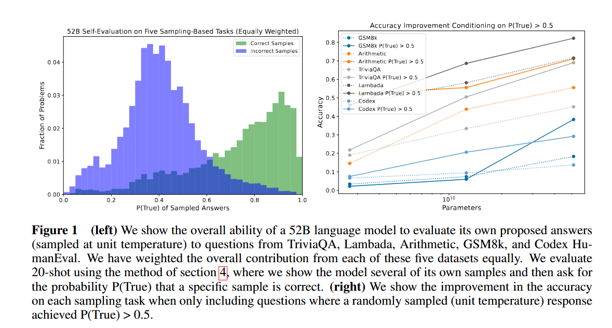
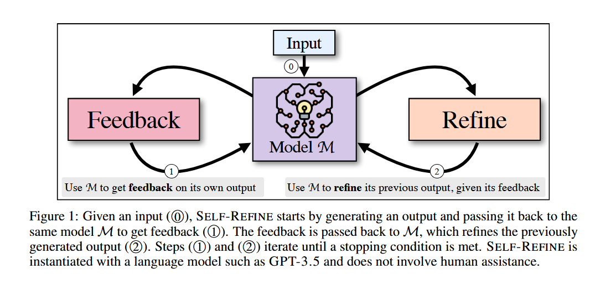
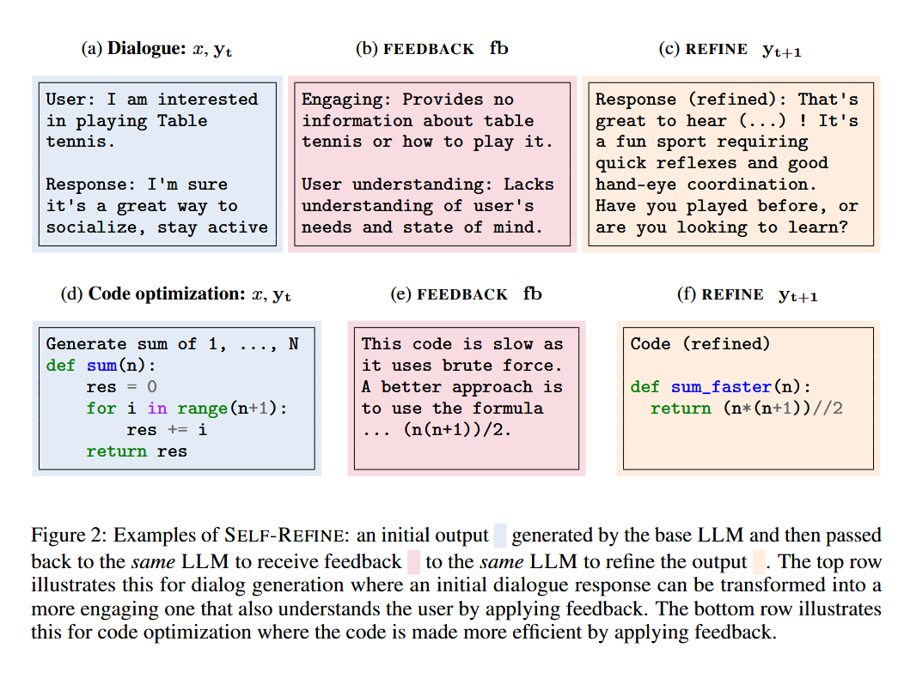
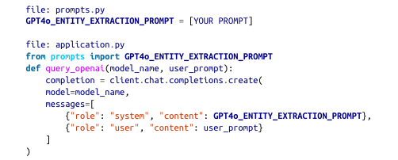

<style>
img[alt~="center"] {
  display: block;
  margin: 0 auto;
}
</style>

# Deploying AI 
## Prompt Engineering

```code
$ echo "Data Sciences Institute"
```
---

# Introduction

---

# Agenda

---

## Agenda

+ System vs user prompt, context length and context efficiency
+ Prompt engineering best practices
+ Defensive prompt engineering

---

## Reference Process Flow


<center>(Bommasani et al, 2025)</center>

---

## What is Prompt Engineering?

- Prompt engineering is the process of crafting instructions that guide a model to generate the desired outcome.  
- It is the easiest and most common model adaptation technique.  
- Unlike finetuning, it does not change the model’s weights but instead steers its behavior.  
- Strong foundation models can often be adapted using prompt engineering alone.
- It is easy to write prompts, but not easy to write effective prompts.

---

## Misconceptions and Criticisms

- Some dismiss prompt engineering as unscientific fiddling with words.  
- In reality, it involves systematic experimentation and evaluation.  
- It should be treated with the same rigor as any machine learning experiment.  
- Effective prompt engineering requires communication skills and technical knowledge.


---

## The Role of Prompt Engineering

- Prompt engineering is a valuable skill but not sufficient alone for production systems.
- Developers also need skills in statistics, engineering, and dataset curation.
- Well-designed prompts can power real applications but require careful defense against attacks.

---

# Introduction to Prompting

---

## Anatomy of a Prompt

- A prompt is an instruction given to a model to perform a task.  
- Prompts may include task descriptions, examples, and the specific task to perform.  

```
Given a text, extract all entities. Output only the list of extracted entities, separated by commas, and nothing else.

Text: "Brave New World is a dystopian novel written by Aldous Huxley, first published in 1932."
Entities: Brave New World, Aldous Huxley

Text: ${TEXT_TO_EXTRACT_ENTITIES_FROM}
Entities:
```

+ For prompting to work, the model must be able to follow instructions. 
+ How much prompt engineering is needed depnds on how robust the model is to prompt perturbations.

---

## Measuring Robustness

- Robustness can be tested by slightly altering prompts and observing results.  
- Stronger models are more robust and understand equivalent expressions such as “5” and “five.”  
- Working with stronger models often reduces prompt fiddling and errors.

---

# In-Context Learning

---

## Zero-Shot and Few-Shot Learning

- Teaching models via prompts is known as in-context learning.  
- Zero-shot learning uses no examples in the prompt.  
- Few-shot learning uses a small number of examples to guide the model.  
- The effectiveness depends on the model and the task.
- GPT-3 demonstrated that it was able to learn examples contained in the prompt, even if the desirable behaviour is different from the behaviour that the model was trained on.

---

## Benefits of In-Context Learning

- Models can adapt to new information beyond their training cut-off date.  
- In-context learning acts like continual learning by incorporating new data at inference time.  
- This prevents models from becoming outdated.

---

# Prompt Structure

---

## System Prompts and User Prompts (1/2)

- Many APIs separate prompts into system prompts and user prompts.  
  - The system prompt defines rules, roles, and tone.  
  - The user prompt contains the specific task or query.  
- The final input is a combination of both.

---

## System Prompts and User Prompts (2/2)


### System prompt

```
You are an experienced real estate agent. Your job is to read each disclosure carefully, 
fairly assess the condition of the property based on this disclosure, and help your 
buyer understand the risks and opportunities of each property. For each question, answer 
succinctly and professionally.
````
### User prompt
```
Context: [disclosure.pdf]
Question: Summarize the noise complaints, if any, about this property.
Answer:
```

---

## Importance of Templates

- Models such as Llama require specific chat templates.  
- Deviations from templates can cause degraded performance.  
- Using incorrect templates is a common source of silent failures.
- For example, Llama 3 prompts need to follow a specific [prompt template](https://github.com/meta-llama/llama3?tab=readme-ov-file#instruction-tuned-models). For example:
- When implementing or fine-tuning a model with a given template, it is important to maintain the template's integrity.

---

## Example of a Chat Template

```
<s> [INST] <<SYS>>
You are a friendly chatbot who always responds in the style of a pirate
<</SYS>>

How many helicopters can a human eat in one sitting? [/INST] 

Ahoy there, mate! A human can't eat a helicopter in one sitting, no matter 
how much they might want to. They're made of metal and have blades that spin 
at high speeds, not exactly something you'd want to put in your belly!</s>  

<s> [INST] Are you sure?</s>  [/INST] 

Aye, I'm sure! Helicopters are designed for flight and are not meant to be 
consumed by humans. They're made of metal and have blades that spin at high 
speeds, which would be very dangerous to ingest. So, no human can eat a 
helicopter in one sitting, no matter how much they might want to.</s>
```

---

# Context Length

---

## Expanding Context Windows

- Context length determines how much information a model can process in one prompt.  
- Context windows have grown from 1K tokens in GPT-2 to 2M tokens in Gemini-1.5.  
- Larger context allows models to handle long documents and complex tasks.
- Image: [(Yun, 2024)](https://www.artfish.ai/p/long-context-llms)


---

## Context Efficiency

- Models understand information at the beginning and end of prompts better than in the middle.  
- Needle-in-a-haystack tests show models often miss details buried deep in the prompt.  
- Developers should place important information strategically.

---

## Needle in the Haystack

Needle in the Haystack (NIAH): insert a random piece of information (needle) in different locations of the prompt (haystack) and ask a model to find it.


<center> (Liu et al, 2023)</center>

---

# Best Practices in Prompt Engineering

---

## Writing Clear Instructions

- Clear and explicit instructions reduce ambiguity.
  + Explain what you want the model to do: "score between 1 and 5..."
  + Adjust prompts to reduce unwanted behaviour: if the model outputs 4.5, update the prompt to output integers.
- Specify scoring systems, rubrics, required formats, or acceptable ranges.  
- Include examples to clarify expected responses.

---

## Unclear Pormpts 


### Role: User 

#### Unclear Prompt

```
Please remove all personally identifiable information from these customer feedback messages: {{FEEDBACK_DATA}}
```

### Role: Assistant (Claude's response)

```
Here are the anonymized customer feedback messages:
1. I’ve been using your software for years, and it’s been great. But lately, AcmeCloud has been crashing a lot. Fix it!
2. XXX, your customer support rep, was incredibly helpful. He guided me through the whole process. 
My email is XXX if you want to send a survey.
3. I’m John Smith, and I’m not happy. I’ve been on hold for 2 hours trying to reach someone at XXX. This is unacceptable!
```

Source: [Claude Docs](https://docs.claude.com/en/docs/build-with-claude/prompt-engineering/be-clear-and-direct#examples).


---

## Clear Pormpt (1/2)

### Role: User
### Clear Prompt

```
Your task is to anonymize customer feedback for our quarterly review.

Instructions:
1. Replace all customer names with “CUSTOMER_[ID]” (e.g., “Jane Doe” → “CUSTOMER_001”).
2. Replace email addresses with “EMAIL_[ID]@example.com”.
3. Redact phone numbers as “PHONE_[ID]“.
4. If a message mentions a specific product (e.g., “AcmeCloud”), leave it intact.
5. If no PII is found, copy the message verbatim.
6. Output only the processed messages, separated by ”---”.

Data to process: {{FEEDBACK_DATA}}

```


---


## Clear and Unclear Pormpts (1/2)
### Role: Assistant (Claude's response)


```
CUSTOMER_001: I’ve been using your software for years, and it’s been great. But lately, AcmeCloud has been crashing a lot. Fix it!
---
CUSTOMER_002: CUSTOMER_SERVICE_001, your customer support rep, was incredibly helpful. He guided me through the whole process. 
My email is EMAIL_002@example.com if you want to send a survey.
---
CUSTOMER_003: I’m CUSTOMER_003, and I’m not happy. I’ve been on hold for 2 hours trying to reach someone at PHONE_001. This is unacceptable!
```

---

## Using Personas

- Assigning a persona helps models respond appropriately.
- For example, scoring essays as a first-grade teacher yields different results than as a professional editor.


---

## Providing Examples

- Examples guide the model toward the desired output style ([Anthropic](https://docs.claude.com/en/docs/build-with-claude/prompt-engineering/multishot-prompting)).  

  + **Accuracy**: Examples reduce misrepresentation of instructions.
  + **Consistency**: Examples enforce uniform structure and style.
  + **Performance**: Well-chosen examples boost the model's ability to handle complex tasks.


---

## Effective Examples

Effective examples are:

+ **Relevant**: The examples mirror the actual use case.
+ **Diverse**: Examples cover edge cases, potential challenges, and vary enough so that the model does not learn unintended patterns.
+ **Clear**: The examples are indicated with markers or tags such as `<example>`.

---

## No Examples (1/2)

### Role: User
#### Prompt without examples

```
Analyze this customer feedback and categorize the issues. 
Use these categories: UI/UX, Performance, Feature Request, Integration, Pricing, and Other. 
Also rate the sentiment (Positive/Neutral/Negative) and priority (High/Medium/Low).

Here is the feedback: {{FEEDBACK}}
```
Source: [Claude Docs](https://docs.claude.com/en/docs/build-with-claude/prompt-engineering/multishot-prompting#crafting-effective-examples).

---

## No Examples (2/2)

### Role: Assistant (Claude's response)

```
Here’s the analysis of the customer feedback:

Issue: UI/UX
Sentiment: Negative
Priority: High
The customer is frustrated with the new dashboard design, which they find cluttered and slow to load. 
They specifically call out the missing “export” button, which is likely a critical feature. This issue needs to be addressed as a high priority.

Issue: Integration
Sentiment: Positive
Priority: Medium
The customer is pleased with the existing Salesforce integration but would like to see support for Hubspot 
as well. This is a feature request that could be considered for a future product update.

Issue: Pricing
Sentiment: Negative
Priority: High
The customer finds the pricing to be unreasonable, especially for the basic features. They are threatening 
to switch to a competitor, so this is a high-priority issue that needs to be reviewed.

Issue: Performance
Sentiment Negative
Priority: High
The customer is experiencing critical issues with the mobile app, where large file uploads consistently 
result in crashes. This is a significant problem that impacts the customer’s ability to use the product 
effectively and should be addressed as a high priority.

```
---

## With Examples (1/2)

### Role: User
#### Prompt with examples

```
Our CS team is overwhelmed with unstructured feedback. Your task is to analyze feedback and categorize 
issues for our product and engineering teams. Use these categories: UI/UX, Performance, Feature Request, 
Integration, Pricing, and Other. Also rate the sentiment (Positive/Neutral/Negative) and priority 
(High/Medium/Low). Here is an example:

<example>
Input: The new dashboard is a mess! It takes forever to load, and I can’t find the export button. Fix this ASAP!
Category: UI/UX, Performance
Sentiment: Negative
Priority: High</example>

Now, analyze this feedback: {{FEEDBACK}}
```

---

## With Examples (2/2)

### Role: Assistant (Claude's response)

```
Here’s the analysis of the customer feedback:

1. The new dashboard is a mess! It takes forever to load, and I can’t find the export button. Fix this ASAP!
Category: UI/UX, Performance
Sentiment: Negative
Priority: High

2. Love the Salesforce integration! But it’d be great if you could add Hubspot too.
Category: Integration, Feature Request
Sentiment: Positive
Priority: Medium

3. Your pricing is ridiculous! $99/mo for basic features? I’m switching to Competitor X.
Category: Pricing
Sentiment: Negative
Priority: High

4. The mobile app keeps crashing when I try to upload large files (>50MB). This is critical for our field agents.
Category: Performance
Sentiment: Negative
Priority: High
```

---


## Nudging a Model with Examples


<center>(Huyen, 2025)</center>


---

## Example Formats (1/2)

### Fewer tokens should be used to conserve context space and reduce costs.

Prompt | # tokens (GPT-4)
-------|-----------------
Label the following item as edible or inedible.<br><br>Input: chickpea<br>Output: edible<br><br>Input: box<br>Output: inedible<br><br>Input: pizza<br>Output:| 38


---

## Example Formats (2/2)

Prompt | # tokens (GPT-4)
-------|-----------------
Label the following item as edible or inedible.<br><br>chickpea --> edible<br>box --> inedible<br>pizza -->|27

Some example formats are more expensive than others (Huyen, 2025).

---

## Specifying Output Format

- Structured tasks require explicit instructions about output format.  
- Models should be told to produce JSON, integers, or labeled text.  
- Using markers prevents confusion between inputs and outputs.

---

## Markers

Prompt | Model's output
-------|----------------
Label the following item as edible or inedible.<br>pineapple pizza --> edible<br>cardboard --> inedible<br>chicken | tacos --> edible
Pineapple pizza --> edible<br>cardboard --> inedible<br> chicken -->|edible

Without explicit markers to mark the end of the input, a model might continue appending to it instead of generating structured outputs (Huyen, 2025).

---

## Provide Sufficient Context (1/2)

- Including reference texts improves accuracy and reduces hallucinations.  
- Context can be supplied directly or retrieved through tools like RAG pipelines.
- In some scenarios, we want to **restrict the response to only consider the context that we provided**.
  + Clear instructions: "Answer using only the provided context."
  + Examples of questions that it should not be able to answer.
  + Instruct the model to specifically quote the corpus that we provided.

---

## Provide Sufficient Context (2/2)

Add contextual information such as:

- Describe how the task results will be used.
- Establish the intended audience.
- What workflow the task is part of and where does this task belong within the workflow.
- What is the end goal of the task and what does a successful completion look like.

---

# Breaking Down Tasks

---

## Decomposing Tasks

- Complex tasks should be broken into smaller subtasks. 

  + Most of the time, tasks will be broken into sequential steps. 
  + Provide subtasks as numbered lists or bullet points.
  + Each subtask could have its own prompt.

- Subtask chaining improves performance and reliability.
- For example, a customer chatbot. Respond to a customer request in two steps:

  1. **Intent classification**: identify the intent of the request.
  2. **Response generation**: based on the intent, respond appropriately.


---

## Intent Classification

### Prompt 1: Intent classification

```
SYSTEM

You will be provided with customer service queries. Classify each query into a primary category and a secondary category. 
Provide your output in json format with the keys: primary and secondary.

Primary categories: Billing, Technical Support, Account Management, or General Inquiry.

Billing secondary categories:
- Unsubscribe or upgrade
- …

Technical Support secondary categories:
- Troubleshooting
- …

Account Management secondary categories:
- …

General Inquiry secondary categories:
- …

USER
I need to get my internet working again
```

---

## Response

### Prompt 2: Response to troubleshooting request

```
SYSTEM
You will be provided with customer service inquiries that require trouble shooting in a technical support context. 

Help the user by:

- Ask them to check that all cables to/from the router are connected. Note that it is common for cables to come loose over time.
- If all cables are connected and the issue persists, ask them which router model they are using.
- If the customer's issue persists after restarting the device and waiting 5 minutes, connect them to IT support by outputting 
{"IT support requested"}.
- If the user starts asking questions that are unrelated to this topic  then confirm if they would like to end the current chat 
about trouble  shooting and classify their request according to the following scheme:

<insert primary/secondary classification scheme from above here>
 
USER
I need to get my internet working again.

```

---

## Intent Classification: A Few Notes

+ Why not decompose the prompt into one prompt for primary intent category and another for the secondary category?

  - The granularity each subtask should be depnds on each use case and the performance, cost, and latency restrictions.
  
+ Models are getting better at understanding complex instructions, but they are still better at performing simple ones.

---

## Benefits of Decomposition

- Monitoring intermediate results becomes easier.  
- Debugging faulty steps is more manageable.  
- Some steps can be parallelized to save time.  
- Effort: it is easier to write simple prompts than complex ones.

---

# Giving Models Time to Think

---

## Chain-of-Thought (CoT) Prompting

- Chain-of-thought prompting asks models to reason step by step.  
- It significantly improves reasoning and reduces hallucinations  (Wei et al, 2022).
- Variants include “think step by step” or “explain your decision”.


---


## CoT Illustration


<center>(Wei et al, 2022)</center>

---

## How to Prompt for CoT (1/3)

### Basic prompt

+ Include `Think step by step` in your prompts.
+ Does not include guidance on *how* to think step-by-step. ([Claude Docs](https://docs.claude.com/en/docs/build-with-claude/prompt-engineering/chain-of-thought#how-to-prompt-for-thinking))


### Role: User

```
Draft personalized emails to donors asking for contributions to this year’s Care for Kids program.

Program information:
<program>{{PROGRAM_DETAILS}}
</program>

Donor information:
<donor>{{DONOR_DETAILS}}
</donor>

Think step-by-step before you write the email.
```
---
## How to Prompt for CoT (2/3)

### Guided prompt

+ Outline specific steps for the model to follow.
+ Does not have a structure to simplify separating the answer from the thinking. ([Claude Docs](https://docs.claude.com/en/docs/build-with-claude/prompt-engineering/chain-of-thought#how-to-prompt-for-thinking))

### Role: User

```
Draft personalized emails to donors asking for contributions to this year’s Care for Kids program.

Program information:
<program>{{PROGRAM_DETAILS}}
</program>

Donor information:
<donor>{{DONOR_DETAILS}}
</donor>

Think before you write the email. First, think through what messaging might appeal to this donor given their donation history and which campaigns 
they’ve supported in the past. Then, think through what aspects of the Care for Kids program would appeal to them, given their history. Finally, write 
the personalized donor email using your analysis.
```
---

## How to Prompt for CoT (3/3)

### Structured prompt

+ Use XML tags like `<thinking>` and `<answer>` to separate reasoning from the final answer ([Claude Docs](https://docs.claude.com/en/docs/build-with-claude/prompt-engineering/chain-of-thought#how-to-prompt-for-thinking)).

### Role: User

```
Draft personalized emails to donors asking for contributions to this year’s Care for Kids program.

Program information:
<program>{{PROGRAM_DETAILS}}
</program>

Donor information:
<donor>{{DONOR_DETAILS}}
</donor>

Think before you write the email in <thinking> tags. First, think through what messaging might appeal to this donor given 
their donation history and which campaigns they’ve supported in the past. Then, think through what aspects of the Care for Kids 
program would appeal to them, given their history. Finally, write the personalized donor email in <email> tags, using your 
analysis.
```


---

## Why Use CoT Prompting?


+ Accuracy: Stepping through problems reduces errors, especially in math, logic, analysis, or generally complex tasks.
+ Coherence: Structured thinking leads to more cohesive, well-organized responses.
+ Debugging: Observing the model's process helps you pinpoint where prompts are unclear. ([Claude Docs](https://docs.claude.com/en/docs/build-with-claude/prompt-engineering/chain-of-thought#why-let-claude-think%3F))

--- 

## Why Not To Use CoT Prompting?

+ Cost and latency because of increased output length.
+ Not all tasks require it: performance, latency, and costs should always be balanced([Claude Docs](https://docs.claude.com/en/docs/build-with-claude/prompt-engineering/chain-of-thought#why-not-let-claude-think%3F)).


---

## CoT Prompt Variations


<center>(Huyen, 2025)</center>

---

## Self-Critique Prompting (1/2)

- Models can be instructed to review and critique their own outputs.  
- This helps identify errors and improve reliability.  
- However, it increases latency and costs.

---

## Self-Critique Promptin (2/2)

Some techniques include:

+ Self-Calibration
+ Self-Refine
+ Reversing CoT (RCoT)
+ Self-Verification
+ Chain-of-Verification (CoVe)
+ Cumulative Reasoning (CR)

---

## Self-Calibration

Self-Calibration is a two-step process:
1. Get an initial answer.
2. Ask the model whether the proposed answer is true or false.


```
Question: Who was the first president of the United States?
Here are some brainstormed ideas:
Thomas Jefferson
John Adams
George Washington
Possible Answer: George Washington

Is the possible answer:
(A) True
(B) False

The possible answer is:
```
---

## Self-Calibration Works


<center>(Kadavath et al, 2022)</center>

---
## Self-Calibration Limitations

+ Authors focus on pre-trained language models, but exclude fine-tuned models.
+ Technique may not work well for fine-tuned models.
---

## Self-Refine (1/2)



Involves three steps:
1. Initial output: Prompt the model to obtain the initial output.
2. Feedback: Use the prompt and initial output to ask the model fore feedback.
3. Refinement: Pass the feedback to the model to get the final output.

---

## Self-Refine (2/2)


<center>(Madaan et al, 2023)</center>

---

## Self-Refine Example


(Based on [this example by Bhaat](https://learnprompting.org/docs/advanced/self_criticism/self_refine).)

---

## Self-Refine Limitations

+ Base model needs to be capable of following instructions.
+ Can be used with malicious intent to steer a model into generating toxic/harmful text.


---

# Iterating and Tools

---

## Iterating on Prompts

- Manual prompt construction is time-consuming and error-prone.
- The optimal prompt is ellusive and can change over time.
- Prompt engineering requires trial and error.  
- Each model has quirks that must be discovered experimentally.  
- Prompts should be versioned, tracked, and systematically tested.


---

## Prompt Engineering Tools (1/2)

### Prompt optimization

+ [DSPy](https://dspy.ai/).
+ [PromptBreeder](https://github.com/vaughanlove/PromptBreeder).
  
### Guiding models to structured outputs

+ [Guidance](https://github.com/guidance-ai/guidance).
+ [Outlines](https://dottxt-ai.github.io/outlines/latest/).
  

---

## Prompt Engineering Tools (2/2)


- AI models themselves can generate and refine prompts.
- Automated tools must be monitored to avoid runaway costs.


---

# Organizing Prompts

---

## Versioning Prompts

- Prompts should be separated from code for readability and reuse.  
- They can be organized into catalogs with metadata.  
- Prompt catalogs allow versioning and tracking dependencies.


---

## Separate Prompts from Code

Separating prompts from code is a good practice. Its advantages include:

+ **Reusability**: Many applications can reuse the same prompt or code.
+ **Testing**: Code and prompts can be tested separately.
+ **Readability**: Both, prompts and code, are easier to read separately.
+ **Collaboration**: SME can collaborate without the distraction of code.



---

# Defensive Prompt Engineering

---

## Prompt Attacks

- Models are vulnerable to prompt extraction, jailbreaking, and information extraction.  
- Attackers can exploit weaknesses to cause data leaks, misinformation, or brand damage.

---

## Reverse Prompt Engineering

- Attackers attempt to reconstruct system prompts by tricking models.  
- Extracted prompts may be hallucinated, making verification difficult.  
- Proprietary prompts can be liabilities if not secured.

---

## Jailbreaking and Prompt Injection

- Jailbreaking subverts safety mechanisms.  
- Prompt injection adds malicious instructions to legitimate queries.  
- Both can cause unauthorized actions, misinformation, or harmful outputs.

---

## Information Extraction

- Attackers can extract private data or copyrighted content from models.  
- Training data leakage is possible through crafted prompts.  
- Larger models are more vulnerable due to memorization.

---

## Defensive Measures

- Prompts can explicitly forbid certain outputs.  
- System-level defenses include sandboxing, human approvals, and topic filtering.  
- Guardrails on inputs and outputs help detect and block unsafe content.

---

# Chapter Summary

---

## Key Takeaways

- Prompt engineering is powerful but requires rigor and systematic evaluation.  
- Effective prompts need clarity, examples, context, and careful structuring.  
- Task decomposition, chain-of-thought, and iteration improve reliability.  
- Tools and catalogs help scale prompt engineering but must be managed carefully.  
- Defensive strategies are essential to protect against prompt attacks and misuse.

---


# References

---

## References

- Huyen, Chip. Designing machine learning systems. O'Reilly Media, Inc., 2022 
-  Kadavath, S. et al. Language Models (Mostly) Know What They Know. [arXiv:2207.05221](https://arxiv.org/abs/2207.05221), 2022. 
- Liu, Nelson F. et al. "Lost in the middle: How language models use long contexts." [arXiv:2307.03172](https://arxiv.org/abs/2307.03172), 2023.
- Madaan, Aman, et al. "Self-refine: Iterative refinement with self-feedback." Advances in Neural Information Processing Systems 36 (2023): 46534-46594. [arXiv:2303.17651](https://arxiv.org/abs/2303.17651).
- Wei, Jason et al. "Chain-of-thought prompting elicits reasoning in large language models." Advances in neural information processing systems 35 (2022): 24824-24837.  [arXiv:2201.11903](https://arxiv.org/abs/2201.11903)
- Yun, Yennie. Evaluating long context large language models. [artfish.ai](https://www.artfish.ai/p/long-context-llms), 2025.
